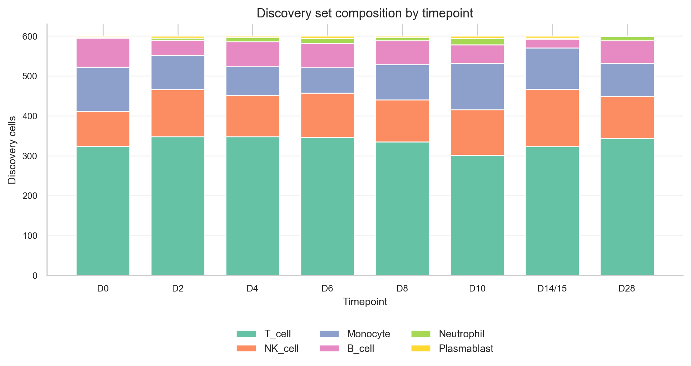

# **Data Exploration**
***

Before fitting or interpreting CoGAPS, we need to understand what is in the teaching discovery set.

## **Experimental Discovery Set Composition**

The discovery set is balanced by experimental sample and then summarized by broad immune-cell type.

{fig-alt="Stacked bar chart showing broad immune-cell composition across experimental dengue infection timepoints." width=850 .lightbox}

::: {.panel-tabset}

## R

```{r}
#| label: composition-summary-r
composition |>
  group_by(broad_cell_type) |>
  summarize(
    n_cells = sum(n_cells),
    mean_fraction = mean(fraction),
    .groups = "drop"
  ) |>
  arrange(desc(n_cells)) |>
  knitr::kable(digits = 3)
```

## Python

```{python}
#| label: composition-summary-python
(
    composition_py
    .groupby("broad_cell_type", as_index=False)
    .agg(n_cells=("n_cells", "sum"), mean_fraction=("fraction", "mean"))
    .sort_values("n_cells", ascending=False)
)
```

:::

This table helps learners see why pattern interpretation must consider cell type. A temporal pattern can reflect changing cell composition, changing expression within a cell type, or both.

## **What Does a CoGAPS Pattern Contain?**

Each pattern has two linked views:

- **Gene loadings:** which genes define the pattern.
- **Cell scores:** which cells use the pattern.

::: {.panel-tabset}

## R

```{r}
#| label: inspect-ifn-top-genes-r
r_top_genes |>
  filter(pattern == "Pattern3") |>
  arrange(rank) |>
  select(pattern, rank, gene, weight) |>
  head(15) |>
  knitr::kable(digits = 3)
```

## Python

```{python}
#| label: inspect-ifn-top-genes-python
py_top_genes.loc[
    py_top_genes["pattern"].eq("Pattern3"),
    ["pattern", "rank", "gene", "weight"]
].sort_values("rank").head(15)
```

:::

The top genes for `Pattern3` include `LY6E`, `ISG15`, `IFITM1`, `IFI6`, `MX1`, `IRF7`, `IFI44L`, `IFIT3`, and `OAS1`, which supports the interferon-associated interpretation.

***
