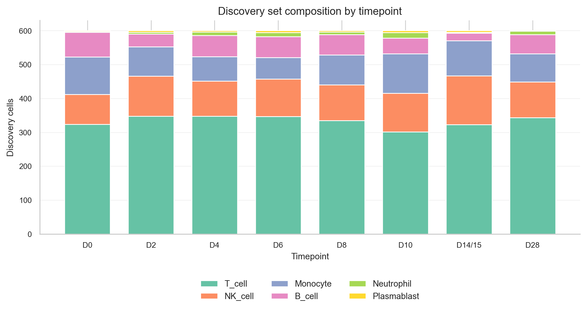

# **Data Exploration**
***

Now that you have imported the , you should inspect the  and the selected `K = 10`  summaries before interpreting any pattern biologically. The model rank has been chosen, but the numbered patterns are still just . This section asks a few checks before moving into interpretation: are the subjects and timepoints represented, what broad cell types dominate the discovery set, and what information is stored in the pattern-evidence tables?

This section uses the small included standard-path tables. If you later run the full reproduction scripts, you can repeat the same checks on the regenerated equivalent tables.

## Check Subject and Timepoint Coverage

Before asking which CoGAPS patterns change over time, you should check whether the discovery set is balanced across subjects and infection days. This check uses the subject-level pattern summary imported in **Data Import**. A temporal comparison is easier to interpret when the same subjects and similar numbers of cells are represented at each timepoint.

This check is not about CoGAPS yet. It asks whether the data structure supports the biological question. If one infection day had fewer subjects, many fewer cells, or a missing sample, an apparent temporal pattern could partly reflect sampling coverage rather than infection biology.

The  table is stored in ****. In a long table, each row holds one measurement for one group. Here, each row is one subject, one timepoint, and one CoGAPS pattern. Because the selected model has 10 patterns, the same subject-timepoint cell count appears 10 times. To check coverage, you first need one row per subject and timepoint.

| Column | Meaning | Why it matters in this check |
|---|---|---|
| `subject` | Experimental participant. | Identifies the . |
| `timepoint_merged` | Infection-day label, such as `D0` or `D14/15`. | Names the timepoint being compared. |
| `day_merged_numeric` | Numeric version of the infection day. | Sorts the timepoints in biological order. |
| `pattern` | CoGAPS pattern ID. | Explains why subject-timepoint rows are repeated. |
| `n_cells` | Number of discovery cells in the subject-timepoint summary. | Measures coverage before pattern interpretation. |

### Step 1: Import the Subject-Level Long Table

Begin by reading the table and inspecting the columns that define coverage. In both R and Python, the imported object is a table. The preview below shows why this file is called "long": `Subject2` at `D0` appears once for each pattern.

::: {.panel-tabset}

#### R

```{r}
#| label: subject-timepoint-import-r
subject_pattern_scores <- readr::read_csv(
  here::here("data", "processed", "interpretation", "subject_level",
             "subject_time_pattern_means_long.csv"),
  show_col_types = FALSE
)

timepoint_order <- c("D0", "D2", "D4", "D6", "D8", "D10", "D14/15", "D28")

subject_pattern_scores |>
  select(subject, timepoint_merged, day_merged_numeric, pattern, n_cells) |>
  head(8) |>
  knitr::kable()
```

#### Python

```{python}
#| label: subject-timepoint-import-python
py_subject_pattern_scores = pd.read_csv(
    "data/processed/interpretation/subject_level/"
    "subject_time_pattern_means_long.csv"
)

py_timepoint_order = ["D0", "D2", "D4", "D6", "D8", "D10", "D14/15", "D28"]

py_subject_pattern_scores.loc[
    :, ["subject", "timepoint_merged", "day_merged_numeric", "pattern", "n_cells"]
].head(8)
```

:::

The first rows show repeated coverage information because the table is organized by pattern. That is useful for pattern summaries, but it is not the right shape for checking subject-timepoint coverage.

### Step 2: Keep One Row per Subject and Timepoint

Next, remove repeated coverage rows. In R, `dplyr::distinct()` keeps unique combinations of selected columns. In Python, `drop_duplicates()` does the same job. This is not filtering cells out of the dataset; it is reducing repeated summary rows so the coverage check counts each subject-timepoint once.

::: {.panel-tabset}

#### R

```{r}
#| label: subject-timepoint-unique-r
subject_time_counts <- subject_pattern_scores |>
  distinct(subject, timepoint_merged, day_merged_numeric, n_cells) |>
  mutate(timepoint_merged = factor(timepoint_merged, levels = timepoint_order)) |>
  arrange(subject, day_merged_numeric)

data.frame(
  table = c("pattern-level rows", "unique subject-timepoint rows"),
  rows = c(nrow(subject_pattern_scores), nrow(subject_time_counts))
) |>
  knitr::kable()
```

#### Python

```{python}
#| label: subject-timepoint-unique-python
py_subject_time_counts = (
    py_subject_pattern_scores
    .loc[:, ["subject", "timepoint_merged", "day_merged_numeric", "n_cells"]]
    .drop_duplicates()
    .sort_values(["subject", "day_merged_numeric"])
)

pd.DataFrame({
    "table": ["pattern-level rows", "unique subject-timepoint rows"],
    "rows": [len(py_subject_pattern_scores), len(py_subject_time_counts)],
})
```

:::

The row count drops because the repeated pattern rows have been collapsed to one row per subject-timepoint. This prepares the data for a coverage table where subjects and days can be inspected directly.

### Step 3: Make a Subject-by-Day Coverage Table

A **** places subjects in rows and timepoints in columns. This layout is useful for exploration because missing or uneven coverage becomes visible quickly. The values in the table are discovery cells, not pattern scores.

::: {.panel-tabset}

#### R

```{r}
#| label: subject-timepoint-coverage-r
subject_time_counts |>
  select(subject, timepoint_merged, n_cells) |>
  tidyr::pivot_wider(
    names_from = timepoint_merged,
    values_from = n_cells
  ) |>
  knitr::kable()
```

#### Python

```{python}
#| label: subject-timepoint-coverage-python
(
    py_subject_time_counts
    .pivot(index="subject", columns="timepoint_merged", values="n_cells")
    .loc[:, py_timepoint_order]
    .reset_index()
)
```

:::

Read across each row. Each subject contributes cells at every infection day used in the main experimental time course. That makes later  easier to compare because the same three subjects are represented throughout the time course.

### Step 4: Summarize Coverage by Infection Day

The final coverage check groups rows by timepoint. In R, `group_by()` and `summarize()` create a grouped summary. In Python, `groupby()` and `agg()` do the same thing. The `n_subjects` column checks whether all three subjects appear at each day. The `discovery_cells` column checks the total number of cells represented at each day.

::: {.panel-tabset}

#### R

```{r}
#| label: timepoint-total-check-r
subject_time_counts |>
  group_by(timepoint_merged, day_merged_numeric) |>
  summarize(
    n_subjects = n_distinct(subject),
    discovery_cells = sum(n_cells),
    .groups = "drop"
  ) |>
  arrange(day_merged_numeric) |>
  select(timepoint_merged, n_subjects, discovery_cells) |>
  knitr::kable()
```

#### Python

```{python}
#| label: timepoint-total-check-python
(
    py_subject_time_counts
    .groupby(["timepoint_merged", "day_merged_numeric"], as_index=False)
    .agg(
        n_subjects=("subject", "nunique"),
        discovery_cells=("n_cells", "sum"),
    )
    .sort_values("day_merged_numeric")
    .loc[:, ["timepoint_merged", "n_subjects", "discovery_cells"]]
)
```

:::

:::{.think_question}
::::{.think_question_header}
Checkpoint
::::
::::{.inner_block}
Why should you not count the rows of `subject_pattern_scores` directly to estimate the number of subject-timepoint observations?

<details>
<summary>Show answer</summary>

Each subject-timepoint appears once for each CoGAPS pattern. Counting rows in the long pattern table would multiply the coverage by the number of patterns and would overstate the number of biological subject-timepoint observations.

</details>
::::
:::

The coverage check shows that the discovery set contains three experimental subjects at each infection timepoint. Each subject contributes 200 discovery cells per timepoint, for 600 cells per timepoint. This means the main temporal comparisons are not driven by a missing subject or a major difference in total discovery-set size across days. However, balanced cell counts do not guarantee that the mixture of immune-cell types is identical across days, so the next exploration step checks broad immune-cell composition.

## Inspect Broad Cell-Type Composition

The previous check showed that each timepoint has the same number of discovery cells. That is useful, but it does not mean the same types of immune cells are present in the same proportions. Because , or PBMCs, are a mixture of immune-cell types, you should inspect broad cell-type composition before interpreting temporal CoGAPS patterns.

This check asks whether a later pattern might be influenced by the mixture of broad immune-cell types. A pattern can look temporal because cells are changing their , because the mixture of immune-cell types changes, or because both are happening at once.

The composition table has one row for each infection day and broad immune-cell type.

| Column | Meaning | Why it matters |
|---|---|---|
| `timepoint_merged` | Infection-day label, such as `D0` or `D14/15`. | Names the timepoint being compared. |
| `day_merged_numeric` | Numeric version of the infection day. | Sorts days in time-course order. |
| `broad_cell_type` | Coarse immune-cell label. | Shows the PBMC mixture. |
| `n_cells` | Number of discovery cells in that cell type and timepoint. | Counts each part of the mixture. |
| `fraction` | Fraction of cells at that timepoint in the cell type. | Makes cell-type composition comparable across days. |

### Step 1: Preview the Composition Table

Start by inspecting the rows you are about to summarize. In this table, one row represents one broad cell type at one infection day. The `fraction` column is already scaled within each timepoint, so the fractions across cell types for one day add up to 1.

::: {.panel-tabset}

#### R

```{r}
#| label: composition-preview-r
composition <- readr::read_csv(
  here::here("data", "processed", "figures", "source_tables",
             "figure_02_discovery_set_composition_source.csv"),
  show_col_types = FALSE
)

composition |>
  mutate(timepoint_merged = factor(timepoint_merged, levels = timepoint_order)) |>
  arrange(day_merged_numeric, broad_cell_type) |>
  select(timepoint_merged, broad_cell_type, n_cells, fraction) |>
  head(10) |>
  knitr::kable(digits = 3)
```

#### Python

```{python}
#| label: composition-preview-python
composition_py = pd.read_csv(
    "data/processed/figures/source_tables/"
    "figure_02_discovery_set_composition_source.csv"
)

(
    composition_py
    .sort_values(["day_merged_numeric", "broad_cell_type"])
    .loc[:, ["timepoint_merged", "broad_cell_type", "n_cells", "fraction"]]
    .head(10)
)
```

:::

This preview tells you how to read the table before summarizing it. For example, a row with `timepoint_merged = D0` and `broad_cell_type = T_cell` describes T cells within the `D0` discovery-set cells, not all T cells in the original source study.

### Step 2: Read the Composition Figure

The stacked bar chart shows the same idea visually. Each bar is one infection day. The full bar height is the number of discovery cells at that day. The colored segments show how many of those cells belong to each broad immune-cell type.

{fig-alt="Stacked bar chart showing broad immune-cell composition across experimental dengue infection timepoints." width=850 .lightbox}

The first thing to notice is that each timepoint is close to 600 discovery cells. This agrees with the coverage check above: later timepoint comparisons are not driven simply by one day having many more cells than another.

The second thing to notice is that the bars are not identical. T cells are the largest broad cell-type group at every timepoint, while monocytes, natural killer cells, B cells, neutrophils, and plasmablasts vary across days. These counts describe the balanced discovery set, not the original abundance of each cell type in the full source study.

### Step 3: Summarize Cell Types Across the Whole Discovery Set

Now make a grouped summary. A grouped summary splits the table into groups, calculates one row of results per group, and then puts those rows back together. In R, `group_by()` creates the groups and `summarize()` calculates the totals. In Python, `groupby()` and `agg()` do the same job.

Here, the groups are broad cell types. The summary totals the number of discovery cells and calculates the average fraction across timepoints.

::: {.panel-tabset}

#### R

```{r}
#| label: composition-summary-r
composition |>
  group_by(broad_cell_type) |>
  summarize(
    n_cells = sum(n_cells),
    mean_fraction = mean(fraction),
    .groups = "drop"
  ) |>
  arrange(desc(n_cells)) |>
  knitr::kable(digits = 3)
```

#### Python

```{python}
#| label: composition-summary-python
(
    composition_py
    .groupby("broad_cell_type", as_index=False)
    .agg(n_cells=("n_cells", "sum"), mean_fraction=("fraction", "mean"))
    .sort_values("n_cells", ascending=False)
)
```

:::

The discovery set is dominated by T cells, with monocytes and natural killer cells also contributing substantial numbers of cells. That matters because a pattern with high scores in T cells might appear across many timepoints simply because T cells are common.

### Step 4: Convert Fractions to Percentages

Fractions are convenient for computation, but percentages are often easier to read. A fraction of `0.25` means 25 percent of the discovery cells at that timepoint are in that broad cell type. In R, `mutate()` creates a new column. In Python, `assign()` does the same kind of column creation.

::: {.panel-tabset}

#### R

```{r}
#| label: composition-percent-r
composition_percent <- composition |>
  mutate(
    timepoint_merged = factor(timepoint_merged, levels = timepoint_order),
    fraction_percent = 100 * fraction
  )

composition_percent |>
  arrange(day_merged_numeric, desc(fraction_percent)) |>
  select(timepoint_merged, broad_cell_type, fraction_percent) |>
  head(10) |>
  knitr::kable(digits = 1)
```

#### Python

```{python}
#| label: composition-percent-python
py_composition_percent = composition_py.assign(
    fraction_percent=lambda df: 100 * df["fraction"]
)

(
    py_composition_percent
    .sort_values(["day_merged_numeric", "fraction_percent"],
                 ascending=[True, False])
    .loc[:, ["timepoint_merged", "broad_cell_type", "fraction_percent"]]
    .head(10)
    .round({"fraction_percent": 1})
)
```

:::

This step does not change the underlying biological information. It changes the display scale so the next table is easier to read.

### Step 5: Make a Timepoint-by-Cell-Type Table

For temporal interpretation, it is useful to reshape the composition table so each row is an infection day and each column is a broad immune-cell type. This is a **wide table**. In R, `tidyr::pivot_wider()` creates this layout. In Python, `pivot_table()` does the same kind of reshape.

::: {.panel-tabset}

#### R

```{r}
#| label: composition-wide-r
composition_fraction_table <- composition_percent |>
  select(timepoint_merged, day_merged_numeric,
         broad_cell_type, fraction_percent) |>
  tidyr::pivot_wider(
    names_from = broad_cell_type,
    values_from = fraction_percent,
    values_fill = 0
  ) |>
  arrange(day_merged_numeric) |>
  select(-day_merged_numeric)

composition_fraction_table |>
  knitr::kable(digits = 1)
```

#### Python

```{python}
#| label: composition-wide-python
py_composition_fraction_table = (
    py_composition_percent
    .pivot_table(
        index=["day_merged_numeric", "timepoint_merged"],
        columns="broad_cell_type",
        values="fraction_percent",
        fill_value=0,
    )
    .reset_index()
    .sort_values("day_merged_numeric")
    .drop(columns="day_merged_numeric")
)

py_composition_fraction_table.columns.name = None
py_composition_fraction_table.round(1)
```

:::

Use this table as a warning label for the later visualization and analysis sections. For example, T cells are common at every timepoint, while monocyte, natural killer cell, and B-cell fractions vary across the time course. Later, when a pattern changes over time, you will ask whether it is tracking infection activity, broad , or both.

:::{.think_question}
::::{.think_question_header}
Checkpoint
::::
::::{.inner_block}
Suppose a CoGAPS pattern is strongest in a broad cell type that becomes more common at `D10`. Why might that pattern look temporal even if cells in that cell type are not changing their gene-expression activity?

<details>
<summary>Show answer</summary>

The average pattern score at `D10` could rise because more cells from the high-scoring cell type are present. That would make the pattern look temporal at the sample level, even if individual cells in that cell type did not increase the program. To separate these explanations, you will later inspect pattern scores by cell type, subject-level trajectories, top genes, and directionality.

</details>
::::
:::

The composition check does not explain CoGAPS patterns by itself. It gives you a caution: temporal plots must be interpreted alongside cell-type summaries. The next exploration step checks what the pattern-evidence tables contain without choosing one numbered pattern yet.

## Map the CoGAPS Evidence Tables

The selected model gives you several evidence tables. Before using those tables to name a biological program, inspect what one row means and how the tables fit together. This keeps the exploration step focused on structure: what evidence exists for each pattern, and what later sections will need to combine?

Each CoGAPS pattern has two linked views. **** tell you which genes define the pattern. **** tell you which cells, subjects, timepoints, or cell groups use the pattern more strongly. You need both views because  can suggest a biological theme, but cell scores show whether that theme appears in the relevant part of the time course.

| Object | What one row means | Key columns | Why you inspect it |
|---|---|---|---|
| `r_top_genes` / `py_top_genes` | One gene in one CoGAPS pattern, ordered by that gene's loading weight. | `pattern`, `rank`, `gene`, `weight` | Identifies genes that help define a pattern. |
| `subject_pattern_scores` / `py_subject_pattern_scores` | One pattern summarized for one subject at one infection day. | `subject`, `timepoint_merged`, `pattern`, `mean_pattern_score` | Shows where a pattern is used across the time course. |

### Step 1: Preview the Top-Gene Table

Start with the top-gene table. In both R and Python, the code uses column selection: keep only the columns needed to understand the table, then print the first few rows. Here, one row links one gene to one pattern.

The word `rank` has a different meaning here than it did in K selection. The selected model has `K = 10` patterns, but the `rank` column in this table orders genes within one pattern's sorted loading list. In the preview below, the column is displayed as `gene_rank` to make that distinction visible.

::: {.panel-tabset}

#### R

```{r}
#| label: top-genes-preview-r
r_top_genes |>
  transmute(pattern, gene_rank = rank, gene, weight) |>
  head(8) |>
  knitr::kable(digits = 3)
```

#### Python

```{python}
#| label: top-genes-preview-python
(
    py_top_genes
    .loc[:, ["pattern", "rank", "gene", "weight"]]
    .rename(columns={"rank": "gene_rank"})
    .head(8)
)
```

:::

The stored `rank` column orders genes within a pattern, starting with the highest-weighted gene. The `weight` column is the nonnegative CoGAPS loading for that gene in that pattern. Higher weights mean the gene contributes more strongly to that pattern, but weights alone do not tell you whether the gene increased or decreased relative to baseline.

### Step 2: Count Top-Gene Evidence by Pattern

Next, check that top-gene evidence exists for every pattern in the selected model. This is a structural check, not a biological ranking. It tells you that each numbered pattern has a comparable top-gene list to inspect later.

::: {.panel-tabset}

#### R

```{r}
#| label: top-genes-pattern-summary-r
top_gene_pattern_summary <- r_top_genes |>
  mutate(pattern_number = as.integer(sub("Pattern", "", pattern))) |>
  group_by(pattern, pattern_number) |>
  summarize(
    n_top_genes = n(),
    first_gene_rank = min(rank),
    last_gene_rank = max(rank),
    highest_weight = max(weight),
    .groups = "drop"
  ) |>
  arrange(pattern_number) |>
  select(-pattern_number)

top_gene_pattern_summary |>
  knitr::kable(digits = 3)
```

#### Python

```{python}
#| label: top-genes-pattern-summary-python
py_top_gene_pattern_summary = (
    py_top_genes
    .assign(pattern_number=lambda df: (
        df["pattern"].str.replace("Pattern", "", regex=False).astype(int)
    ))
    .groupby(["pattern", "pattern_number"], as_index=False)
    .agg(
        n_top_genes=("gene", "size"),
        first_gene_rank=("rank", "min"),
        last_gene_rank=("rank", "max"),
        highest_weight=("weight", "max"),
    )
    .sort_values("pattern_number")
    .drop(columns="pattern_number")
)

py_top_gene_pattern_summary
```

:::

Each selected-model pattern has a top-gene list with 50 genes ordered by within-pattern loading weight. Later, the analysis will ask which of those lists support a specific biological interpretation. For now, the important point is that the table has one comparable gene list per pattern.

### Step 3: Preview the Subject-Timepoint Score Table

Cell scores provide the second view. Instead of asking which genes define a pattern, they ask how strongly a cell or cell group uses that pattern. The subject-level table summarizes those cell scores by subject, infection day, and pattern. A long table keeps one measurement per row, which is useful for grouping, plotting, and checking the unit of evidence.

::: {.panel-tabset}

#### R

```{r}
#| label: all-pattern-subject-long-r
subject_pattern_scores |>
  mutate(
    timepoint_merged = factor(timepoint_merged, levels = timepoint_order),
    pattern_number = as.integer(sub("Pattern", "", pattern))
  ) |>
  arrange(subject, day_merged_numeric, pattern_number) |>
  select(subject, timepoint_merged, pattern, n_cells, mean_pattern_score) |>
  head(12) |>
  knitr::kable(digits = 3)
```

#### Python

```{python}
#| label: all-pattern-subject-long-python
(
    py_subject_pattern_scores
    .assign(pattern_number=lambda df: (
        df["pattern"].str.replace("Pattern", "", regex=False).astype(int)
    ))
    .sort_values(["subject", "day_merged_numeric", "pattern_number"])
    .loc[:, ["subject", "timepoint_merged", "pattern",
             "n_cells", "mean_pattern_score"]]
    .head(12)
)
```

:::

The important unit here is the subject-timepoint-pattern summary, not the individual cell. That matters because cells from the same person at the same infection day are related observations. Later visualizations and analyses use these subject-level summaries so the temporal interpretation is not driven only by the number of cells.

### Step 4: Summarize Score Coverage Across Patterns

Now summarize the score table across all patterns. This check asks whether each selected-model pattern has the same number of subject-timepoint summaries and a comparable score range to inspect later.

::: {.panel-tabset}

#### R

```{r}
#| label: all-pattern-score-coverage-r
score_coverage_by_pattern <- subject_pattern_scores |>
  mutate(pattern_number = as.integer(sub("Pattern", "", pattern))) |>
  group_by(pattern, pattern_number) |>
  summarize(
    n_subject_timepoints = n(),
    n_subjects = n_distinct(subject),
    n_timepoints = n_distinct(timepoint_merged),
    min_score = min(mean_pattern_score),
    median_score = median(mean_pattern_score),
    max_score = max(mean_pattern_score),
    .groups = "drop"
  ) |>
  arrange(pattern_number) |>
  select(-pattern_number)

score_coverage_by_pattern |>
  knitr::kable(digits = 3)
```

#### Python

```{python}
#| label: all-pattern-score-coverage-python
py_score_coverage_by_pattern = (
    py_subject_pattern_scores
    .assign(pattern_number=lambda df: (
        df["pattern"].str.replace("Pattern", "", regex=False).astype(int)
    ))
    .groupby(["pattern", "pattern_number"], as_index=False)
    .agg(
        n_subject_timepoints=("mean_pattern_score", "size"),
        n_subjects=("subject", "nunique"),
        n_timepoints=("timepoint_merged", "nunique"),
        min_score=("mean_pattern_score", "min"),
        median_score=("mean_pattern_score", "median"),
        max_score=("mean_pattern_score", "max"),
    )
    .sort_values("pattern_number")
    .drop(columns="pattern_number")
)

py_score_coverage_by_pattern.round(3)
```

:::

Each pattern has the expected subject-timepoint coverage. The score ranges differ because the model learned different programs, but this table is still not a biological interpretation. It tells you that the evidence is ready for later summaries that compare timing, cell identity, top genes, directionality, and diagnostics.

:::{.think_question}
::::{.think_question_header}
Checkpoint
::::
::::{.inner_block}
Why are top genes not enough to name a CoGAPS pattern biologically?

<details>
<summary>Show answer</summary>

Top genes suggest a biological theme, but they do not show timing, subject consistency, cell-type context, model stability, or expression direction. To support a biological label, later sections connect gene loadings to cell scores, subject-level trajectories, broad cell-type summaries, diagnostics, and directionality relative to baseline.

</details>
::::
:::

This exploration gives you the map of the evidence, not the final interpretation. You now know how to read the coverage, composition, top-gene, and subject-level score tables for the selected `K = 10` model. The next section steps back from these included tables to explain the preprocessing decisions that produced the balanced discovery set. After that, the visualization and analysis sections use these evidence layers to identify and evaluate candidate biological programs.

***
