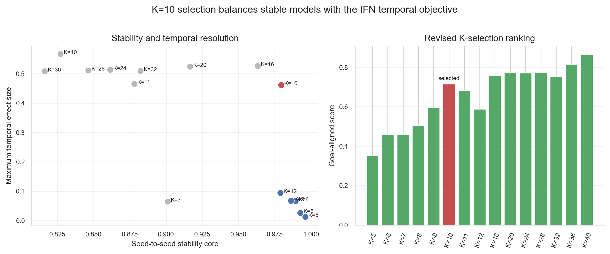
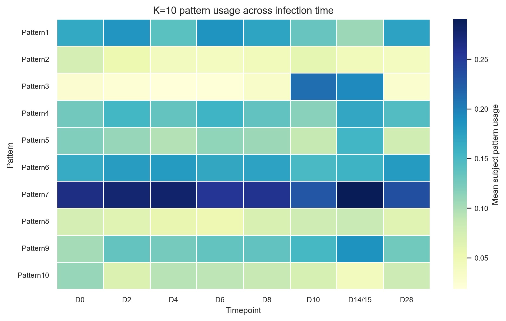
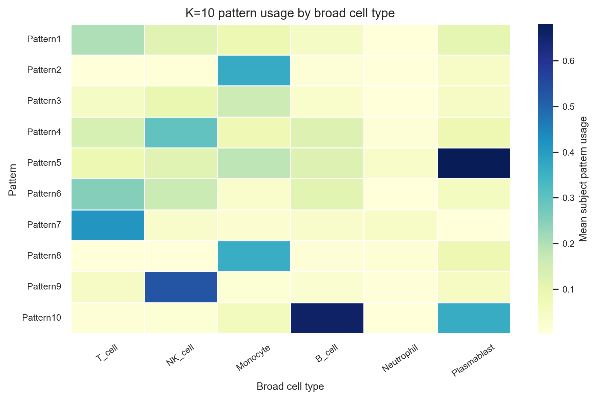
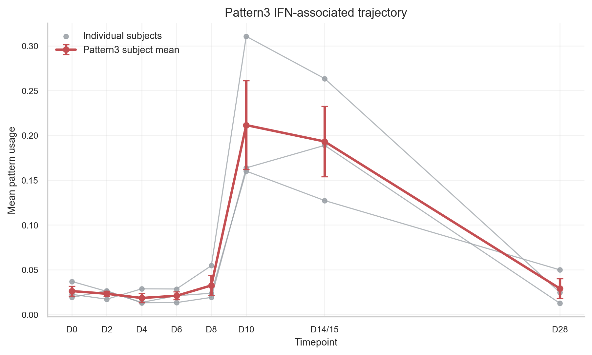
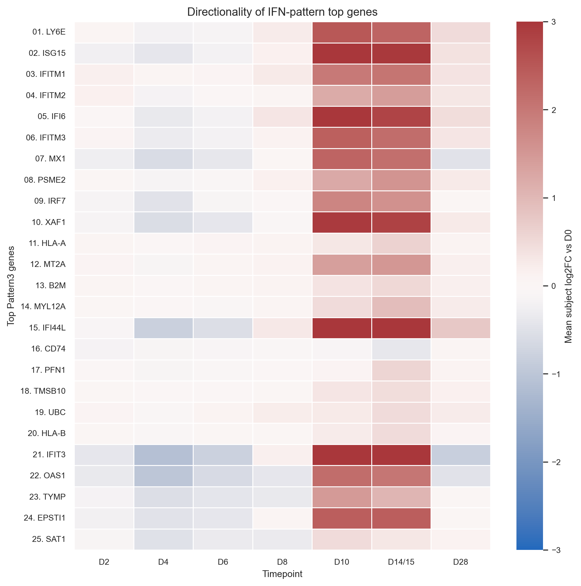
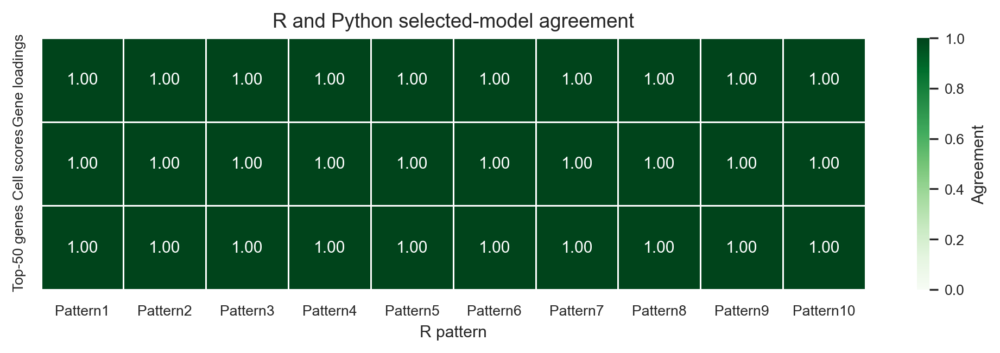

# **Data Visualization**
***

The figures in this section are produced from small source tables in `data/processed/figures/source_tables/`. They are included as pre-rendered images for speed, but the underlying tables are available for learners to modify.

## **K Selection**

{fig-alt="K-selection figure summarizing stability, temporal effect size, and biological signals across tested K values." width=850 .lightbox}

The K-selection figure is used as a teaching exercise. Learners should notice that the most stable model is not automatically the model that best answers the biological question.

## **Pattern Usage Across Time**

{fig-alt="Heatmap of mean CoGAPS pattern usage across experimental timepoints for the selected K=10 model." width=850 .lightbox}

::: {.panel-tabset}

## R

```{r}
#| label: plot-pattern-time-r
pattern_time_matrix <- readr::read_csv(
  here::here("data", "processed", "figures", "source_tables",
             "figure_03_pattern_usage_by_time_matrix.csv"),
  show_col_types = FALSE
)

pattern_time_long <- pattern_time_matrix |>
  tidyr::pivot_longer(
    cols = -pattern,
    names_to = "timepoint",
    values_to = "mean_usage"
  )

ggplot(pattern_time_long, aes(x = timepoint, y = pattern, fill = mean_usage)) +
  geom_tile() +
  scale_fill_viridis_c(option = "C") +
  labs(x = "Experimental timepoint", y = "CoGAPS pattern", fill = "Mean usage") +
  theme_minimal(base_size = 11) +
  theme(axis.text.x = element_text(angle = 45, hjust = 1))
```

## Python

```{python}
#| label: plot-pattern-time-python
import matplotlib.pyplot as plt

pattern_time_matrix = pd.read_csv(
    "data/processed/figures/source_tables/"
    "figure_03_pattern_usage_by_time_matrix.csv"
)
pattern_time_long = pattern_time_matrix.melt(
    id_vars="pattern", var_name="timepoint", value_name="mean_usage"
)

pivot = pattern_time_long.pivot(
    index="pattern", columns="timepoint", values="mean_usage"
)
fig, ax = plt.subplots(figsize=(8, 4.5))
image = ax.imshow(pivot.values, aspect="auto")
ax.set_xticks(range(pivot.shape[1]), pivot.columns, rotation=45, ha="right")
ax.set_yticks(range(pivot.shape[0]), pivot.index)
ax.set_xlabel("Experimental timepoint")
ax.set_ylabel("CoGAPS pattern")
fig.colorbar(image, ax=ax, label="Mean usage")
fig.tight_layout()
plt.show()
```

:::

## **Identity and Activity Views**

{fig-alt="Heatmap of mean CoGAPS pattern usage by broad immune-cell type." width=850 .lightbox}

This view reveals that most patterns are dominated by broad cell type. The IFN-associated pattern is different: it is used most strongly in monocytes but changes much more over time than the identity-like patterns.

## **IFN Pattern Trajectory**

{fig-alt="Subject-level trajectory for the IFN-associated CoGAPS pattern, showing a rise at day 10 and day 14 or 15." width=850 .lightbox}

Subject-level trajectories make the central finding visible without treating each cell as an independent person.

## **Directionality and R/Python Agreement**

{fig-alt="Heatmap showing log2 fold-change directionality for top IFN-associated pattern genes across timepoints." width=850 .lightbox}

{fig-alt="Agreement summary comparing matched R and Python CoGAPS patterns." width=850 .lightbox}

The directionality figure answers a question CoGAPS cannot answer alone: are the top genes in the IFN-associated pattern higher than baseline at the peak timepoints? The R/Python agreement figure confirms that the selected R and Python workflows produce matching artifacts.

***
