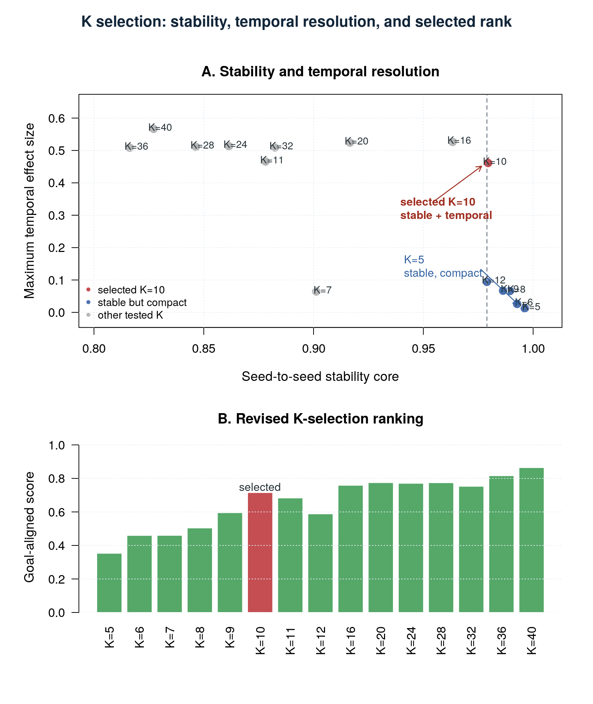
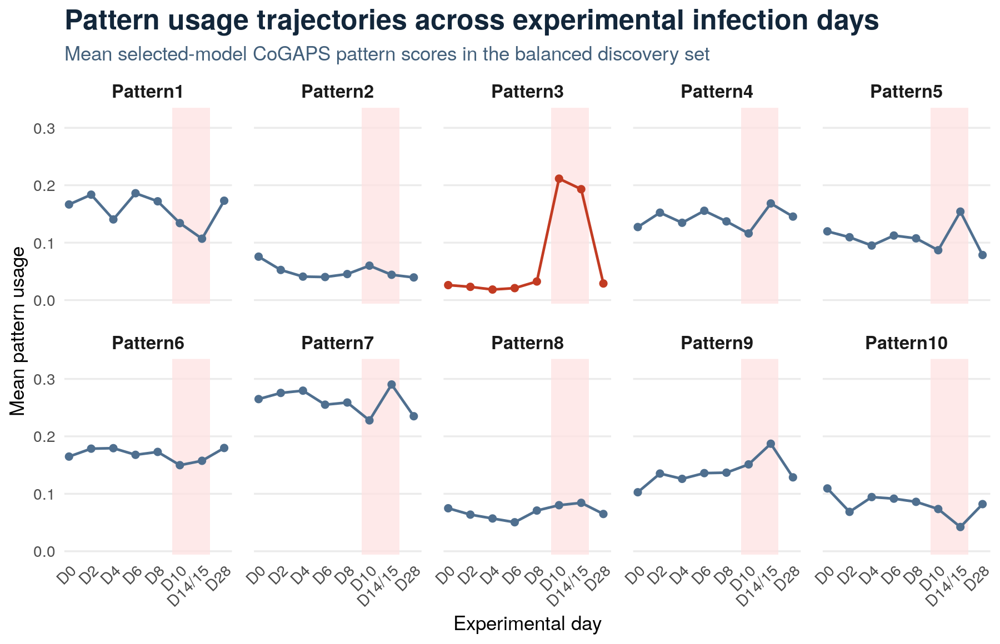
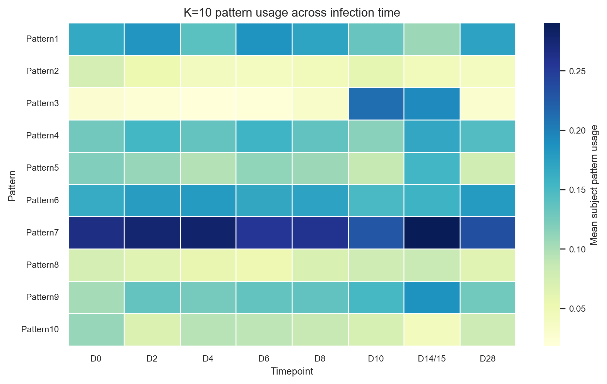
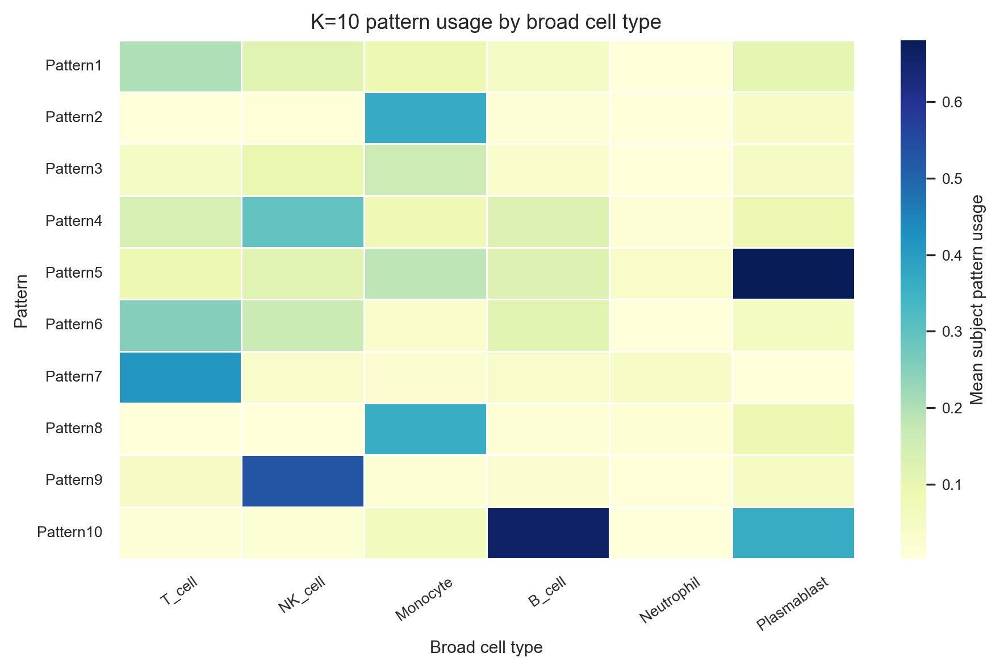
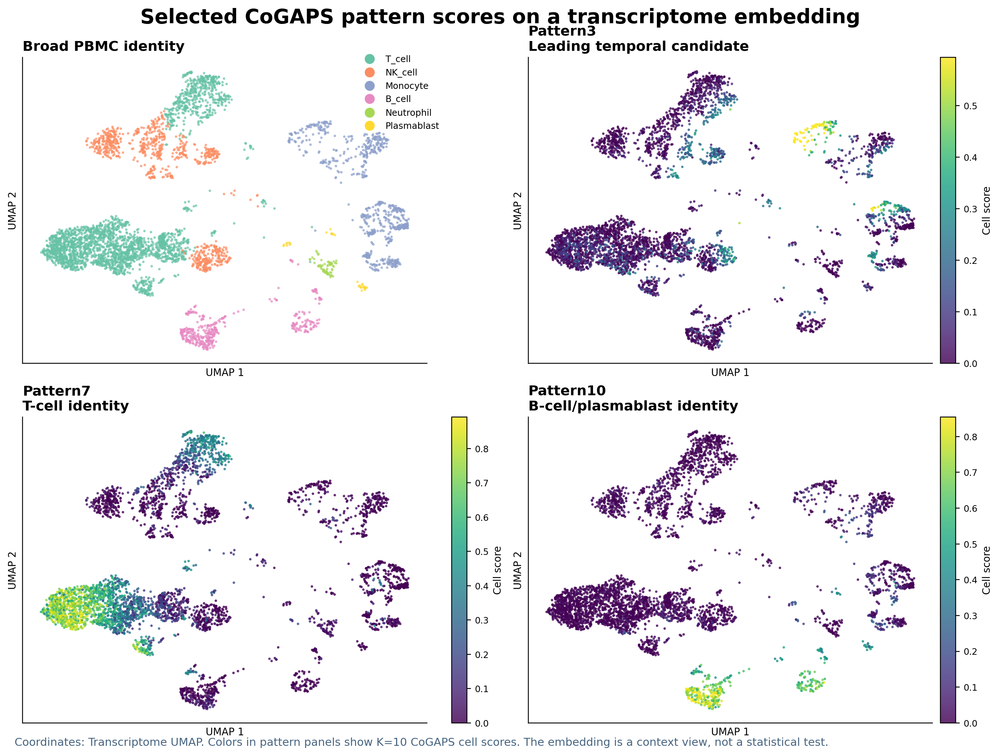
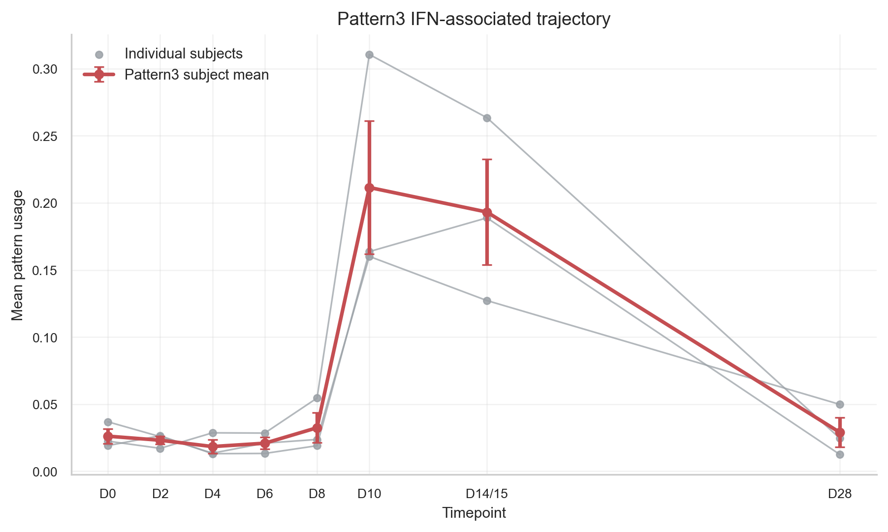
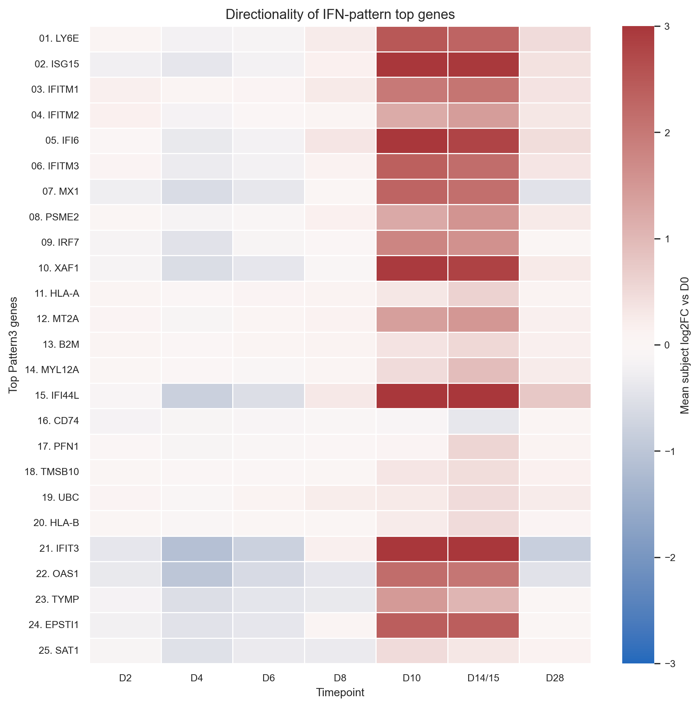

# **Data Visualization**
***

The previous sections showed where the data came from, how the prepared discovery set was created, and how cell-level CoGAPS scores were summarized. In this section, you will use figures as a visual triage step. The goal is not to prove the biological interpretation yet. The goal is to decide which patterns deserve closer analysis and which alternative explanations still need to be checked.

The figures are built from small source tables in `data/processed/figures/source_tables/`. Saved images are shown first so you can read the evidence quickly. The R and Python code then show how the same source tables become the plots, so you can modify or recreate the figures without rerunning CoGAPS.

| Figure | Source table | What it shows | Research question | What it cannot prove |
|---|---|---|---|---|
| K-selection figure | `figure_01_k_selection_source.csv` | How candidate model ranks balance stability, temporal resolution, and goal-aligned evidence. | Why use `K = 10` for the main model? | It does not identify a biological program by itself. |
| Pattern usage across time | `figure_03_pattern_usage_by_time_matrix.csv` | Mean pattern usage trajectories and heatmap summaries for each CoGAPS pattern across infection days. | Which temporal programs appear across the experimental time course? | It does not tell whether a pattern is driven by cell identity, subject effects, or gene-direction changes. |
| Pattern usage by broad cell type | `figure_04_pattern_usage_by_cell_type_matrix.csv` | Mean pattern usage across broad PBMC identities. | Which patterns look identity-like versus activity-like? | It does not show whether a pattern changes over time within the same cell type. |
| Pattern scores on transcriptome UMAP | `figure_08_transcriptome_umap_pattern_scores_source.csv` | Cell-level pattern scores over a transcriptome embedding. | Where do selected patterns appear in cell-state space? | It is a context view, not a statistical test or a replacement for subject-level summaries. |
| IFN pattern trajectory | `figure_05_ifn_pattern_subject_trajectory_source.csv`; `figure_05_ifn_pattern_summary_trajectory_source.csv` | Subject-level trajectory for the candidate IFN-associated pattern. | Does the candidate IFN program peak in the late acute window? | It does not show whether top genes are higher or lower than baseline. |
| Directionality heatmap | `figure_06_ifn_top_gene_directionality_matrix.csv` | Log2 fold-change direction for top genes in the IFN-associated pattern. | Do top genes support an upregulated late acute response? | It does not replace the CoGAPS model; it adds direction to the non-negative pattern interpretation. |

:::{.definition_box}
::::{.definition_box_header}
How to read the figures in this section
::::
::::{.inner_block}
A CoGAPS heatmap cell is a mean pattern score, not an upregulated or downregulated gene. Pattern names such as `Pattern3` are model labels until they are connected to timing, cell identity, top genes, directionality, and diagnostics. UMAP plots provide cell-level context, while subject-level trajectories provide stronger evidence for temporal claims.
::::
:::

## K Selection Visualization

{fig-alt="K-selection figure with stability and temporal resolution above a revised goal-aligned K-ranking panel." width=850 .lightbox}

This figure is a visualization of a modeling decision. The top panel asks whether a model rank is stable across seeds while still resolving temporal structure. The bottom panel summarizes a goal-aligned score that combines stability, low redundancy, temporal signal, and IFN-candidate evidence.

Use this plot to compare `K = 5` and `K = 10`. `K = 5` is useful because it is stable and compact, but compact models can compress several biological signals into fewer patterns. `K = 10` stays in a stable region while separating a late acute IFN-associated program more clearly. This is why `K = 10` is used for the main model and `K = 5` remains a sensitivity comparison.

## Pattern Usage Across Time

{fig-alt="Small-multiple line plots of mean CoGAPS pattern usage across experimental infection days for each selected K=10 pattern." width=850 .lightbox}

This source table is the first visual pass at Research Question 1. Because temporal structure can be hard to see in a heatmap alone, you will inspect the same pattern-by-time table in two ways. The line-panel view emphasizes the shape of each pattern over time. The heatmap view emphasizes the relative magnitude of all pattern-day combinations in one compact display.

Start with the line panels. Each panel uses the same y-axis, so a sharp rise in one pattern can be compared with smaller changes in other patterns. `Pattern3` shows the strongest late acute change, rising sharply at `D10` and remaining elevated at `D14/15` before returning toward baseline at `D28`. Other patterns also show temporal structure, but their changes are more modest. For example, `Pattern9` increases toward `D14/15` and then decreases at `D28`, making it a secondary visual candidate to carry forward rather than a pattern to ignore.

{fig-alt="Heatmap of mean CoGAPS pattern usage across experimental timepoints for the selected K=10 model." width=850 .lightbox}

Now use the heatmap as a magnitude check. A line plot can make modest changes easy to notice, but the heatmap helps you compare how large each mean pattern score is relative to the rest of the model. Together, these views support a better first question: not "which single pattern changes?", but "which patterns show temporal structure strong enough to analyze more carefully?"

This figure starts with a reshape. The source table is stored in a wide form, with one row per pattern and one column per infection day. To draw either figure, you convert that table to long form so each row represents one pattern, one day, and one mean usage value. The line panels then map day to the x-axis and mean usage to the y-axis; the heatmap maps day, pattern, and mean usage to a grid of colored tiles.

::: {.panel-tabset}

### R

```{r}
#| label: viz-pattern-time-r
# Infection days should appear in biological order, not alphabetic order.
timepoint_order <- c("D0", "D2", "D4", "D6", "D8", "D10", "D14/15", "D28")

# Read the source table: one row per pattern and one column per timepoint.
pattern_time_matrix <- readr::read_csv(
  here::here("data", "processed", "figures", "source_tables",
             "figure_03_pattern_usage_by_time_matrix.csv"),
  show_col_types = FALSE
)

# Convert from wide to long so each plotted tile has one pattern, day, and score.
pattern_time_long <- pattern_time_matrix |>
  tidyr::pivot_longer(
    cols = -pattern,
    names_to = "timepoint",
    values_to = "mean_usage"
  ) |>
  dplyr::mutate(
    timepoint = factor(timepoint, levels = timepoint_order),
    pattern = factor(pattern, levels = pattern_time_matrix$pattern),
    day_index = as.integer(timepoint),
    is_ifn_candidate = pattern == "Pattern3"
  )

# View 1: line panels emphasize temporal shape.
# The late acute window is shaded in every panel, and Pattern3 is highlighted.
ggplot(pattern_time_long, aes(x = day_index, y = mean_usage, group = pattern)) +
  annotate(
    "rect",
    xmin = which(timepoint_order == "D10") - 0.35,
    xmax = which(timepoint_order == "D14/15") + 0.35,
    ymin = -Inf,
    ymax = Inf,
    fill = "#fee2e2",
    alpha = 0.75
  ) +
  geom_line(aes(color = is_ifn_candidate), linewidth = 0.8) +
  geom_point(aes(color = is_ifn_candidate), size = 1.8) +
  facet_wrap(~ pattern, ncol = 5) +
  scale_color_manual(values = c(`FALSE` = "#4f6f8f", `TRUE` = "#c23b22"), guide = "none") +
  scale_x_continuous(breaks = seq_along(timepoint_order), labels = timepoint_order) +
  scale_y_continuous(limits = c(0, 0.31)) +
  labs(x = "Experimental day", y = "Mean pattern usage") +
  theme_minimal(base_size = 10) +
  theme(
    axis.text.x = element_text(angle = 45, hjust = 1),
    strip.text = element_text(face = "bold"),
    panel.grid.minor = element_blank(),
    panel.grid.major.x = element_blank()
  )

# View 2: the heatmap emphasizes relative magnitude across all pattern-day pairs.
pattern_time_heatmap <- pattern_time_long |>
  dplyr::mutate(pattern = factor(pattern, levels = rev(pattern_time_matrix$pattern)))

ggplot(pattern_time_heatmap, aes(x = timepoint, y = pattern, fill = mean_usage)) +
  geom_tile() +
  scale_fill_viridis_c(option = "C") +
  labs(x = "Experimental timepoint", y = "CoGAPS pattern", fill = "Mean usage") +
  theme_minimal(base_size = 11) +
  theme(axis.text.x = element_text(angle = 45, hjust = 1))
```

### Python

```{python}
#| label: viz-pattern-time-python
timepoint_order = ["D0", "D2", "D4", "D6", "D8", "D10", "D14/15", "D28"]

# Read the source table: one row per pattern and one column per timepoint.
pattern_time_matrix = pd.read_csv(
    "data/processed/figures/source_tables/"
    "figure_03_pattern_usage_by_time_matrix.csv"
)

# Reshape to long form, which makes the pattern-day-score structure explicit.
pattern_time_long = pattern_time_matrix.melt(
    id_vars="pattern", var_name="timepoint", value_name="mean_usage"
)
pattern_time_long["timepoint"] = pd.Categorical(
    pattern_time_long["timepoint"], categories=timepoint_order, ordered=True
)
pattern_time_long["day_index"] = pattern_time_long["timepoint"].cat.codes + 1

# View 1: line panels emphasize temporal shape.
# The late acute window is shaded in every panel, and Pattern3 is highlighted.
patterns = pattern_time_matrix["pattern"].tolist()
fig, axes = plt.subplots(2, 5, figsize=(11, 5.8), sharex=True, sharey=True)
axes = axes.ravel()

for ax, pattern in zip(axes, patterns):
    pattern_df = (
        pattern_time_long.loc[pattern_time_long["pattern"] == pattern]
        .sort_values("day_index")
    )
    color = "#c23b22" if pattern == "Pattern3" else "#4f6f8f"
    ax.axvspan(
        timepoint_order.index("D10") + 1 - 0.35,
        timepoint_order.index("D14/15") + 1 + 0.35,
        color="#fee2e2",
        alpha=0.75,
    )
    ax.plot(pattern_df["day_index"], pattern_df["mean_usage"], marker="o", color=color)
    _ = ax.set_title(pattern, fontweight="bold")
    _ = ax.set_ylim(0, 0.31)
    _ = ax.grid(axis="y", alpha=0.25)

for ax in axes:
    _ = ax.set_xticks(range(1, len(timepoint_order) + 1))
    _ = ax.set_xticklabels(timepoint_order, rotation=45, ha="right")

_ = fig.supxlabel("Experimental day")
_ = fig.supylabel("Mean pattern usage")
fig.tight_layout()
plt.show()

# View 2: the heatmap emphasizes relative magnitude across all pattern-day pairs.
# Pivot back to a matrix for matplotlib and keep the biological day order.
pivot = pattern_time_long.pivot(
    index="pattern", columns="timepoint", values="mean_usage"
).loc[:, timepoint_order]

fig, ax = plt.subplots(figsize=(8, 4.5))
image = ax.imshow(pivot.values, aspect="auto")
ax.set_xticks(range(pivot.shape[1]))
ax.set_xticklabels(pivot.columns, rotation=45, ha="right")
ax.set_yticks(range(pivot.shape[0]))
ax.set_yticklabels(pivot.index)
ax.set_xlabel("Experimental timepoint")
ax.set_ylabel("CoGAPS pattern")
fig.colorbar(image, ax=ax, label="Mean usage")
fig.tight_layout()
plt.show()
```

:::

Before moving on, ask which patterns change most visibly over time and which merely have high average usage. `Pattern3` is the strongest visual candidate because it is low near baseline and higher during the late acute window. `Pattern9` has a smaller rise toward `D14/15`, so it should be treated as a secondary temporal pattern to inspect later. These observations are hypotheses at this point; the Data Analysis section will connect them to subject-level summaries, top genes, directionality, and model diagnostics.

## Pattern Usage by Broad Cell Type

{fig-alt="Heatmap of mean CoGAPS pattern usage by broad immune-cell type." width=850 .lightbox}

This figure connects back to Data Exploration. PBMC samples contain a mixture of immune-cell identities, and that mixture can affect how a pattern looks over time. A pattern can look temporal because cells changed their gene-expression activity, because the mix of cell types changed, or because both happened.

The source table has the same structure as the time heatmap, but the columns are broad PBMC identities instead of infection days. This change in columns changes the biological question. You are no longer asking "when does the pattern appear?" You are asking "which immune-cell identities use this pattern most strongly?"

::: {.panel-tabset}

### R

```{r}
#| label: viz-pattern-celltype-r
cell_type_order <- c(
  "T_cell", "NK_cell", "Monocyte", "B_cell", "Neutrophil", "Plasmablast"
)

# Read the source table: one row per pattern and one column per broad cell type.
pattern_cell_matrix <- readr::read_csv(
  here::here("data", "processed", "figures", "source_tables",
             "figure_04_pattern_usage_by_cell_type_matrix.csv"),
  show_col_types = FALSE
)

# Reshape so each tile represents one pattern-cell-type mean score.
pattern_cell_long <- pattern_cell_matrix |>
  tidyr::pivot_longer(
    cols = -pattern,
    names_to = "broad_cell_type",
    values_to = "mean_usage"
  ) |>
  dplyr::mutate(
    broad_cell_type = factor(broad_cell_type, levels = cell_type_order),
    pattern = factor(pattern, levels = rev(pattern_cell_matrix$pattern))
  )

ggplot(pattern_cell_long, aes(x = broad_cell_type, y = pattern, fill = mean_usage)) +
  geom_tile() +
  scale_fill_viridis_c(option = "C") +
  labs(x = "Broad PBMC identity", y = "CoGAPS pattern", fill = "Mean usage") +
  theme_minimal(base_size = 11) +
  theme(axis.text.x = element_text(angle = 45, hjust = 1))
```

### Python

```{python}
#| label: viz-pattern-celltype-python
cell_type_order = ["T_cell", "NK_cell", "Monocyte", "B_cell", "Neutrophil", "Plasmablast"]

# Read the source table: one row per pattern and one column per broad cell type.
pattern_cell_matrix = pd.read_csv(
    "data/processed/figures/source_tables/"
    "figure_04_pattern_usage_by_cell_type_matrix.csv"
)

# Pivoting is simple here because the CSV is already matrix-like.
celltype_pivot = pattern_cell_matrix.set_index("pattern").loc[:, cell_type_order]

fig, ax = plt.subplots(figsize=(8, 4.5))
image = ax.imshow(celltype_pivot.values, aspect="auto")
ax.set_xticks(range(celltype_pivot.shape[1]))
ax.set_xticklabels(celltype_pivot.columns, rotation=45, ha="right")
ax.set_yticks(range(celltype_pivot.shape[0]))
ax.set_yticklabels(celltype_pivot.index)
ax.set_xlabel("Broad PBMC identity")
ax.set_ylabel("CoGAPS pattern")
fig.colorbar(image, ax=ax, label="Mean usage")
fig.tight_layout()
plt.show()
```

:::

Use this heatmap to separate visual hypotheses. Patterns that are strongest in T cells, B cells, or plasmablasts may be useful identity or composition patterns. A pattern should not be called an infection-response program from this plot alone. For `Pattern3`, the important observation is that it has a temporal signal and is also visible in monocyte-rich regions of the PBMC mixture. The Data Analysis section will test that interpretation more formally.

## Pattern Scores on a Transcriptome UMAP

{fig-alt="Transcriptome UMAP of discovery cells colored by broad PBMC identity and selected K=10 CoGAPS pattern scores for Pattern3, Pattern7, and Pattern10." width=850 .lightbox}

This cell-level context view shows where selected CoGAPS pattern scores appear in transcriptome space. The coordinates come from the transcriptome UMAP stored in the full preprocessed H5AD object. The small source table included here stores only the discovery-cell coordinates, metadata, and selected-model pattern scores.

Do not treat a UMAP as proof. Nearby points are useful for visual context, but the axes are not biological units, and the display can change with preprocessing and embedding parameters. The reason to include this view is narrower: it helps you see that identity-like patterns concentrate in broad cell-state regions, while the IFN-associated pattern appears as a pattern score over cells in those same transcriptome neighborhoods.

::: {.panel-tabset}

### R

```{r}
#| label: viz-pattern-umap-r
# Read the small UMAP table. It contains coordinates, cell metadata, and pattern scores.
embedding_scores <- readr::read_csv(
  here::here("data", "processed", "figures", "source_tables",
             "figure_08_transcriptome_umap_pattern_scores_source.csv"),
  show_col_types = FALSE
)

# Plot only a small set of patterns so the figure remains interpretable.
selected_patterns <- c(
  Pattern3 = "Pattern3: IFN-associated activity",
  Pattern7 = "Pattern7: T-cell identity",
  Pattern10 = "Pattern10: B-cell identity"
)

# Convert selected pattern columns into one long cell-score column for faceting.
embedding_long <- embedding_scores |>
  dplyr::select(cell_id, umap_1, umap_2, dplyr::all_of(names(selected_patterns))) |>
  tidyr::pivot_longer(
    cols = dplyr::all_of(names(selected_patterns)),
    names_to = "pattern",
    values_to = "cell_score"
  ) |>
  dplyr::mutate(pattern_label = selected_patterns[pattern])

ggplot(embedding_long, aes(x = umap_1, y = umap_2, color = cell_score)) +
  geom_point(size = 0.35, alpha = 0.75) +
  facet_wrap(~ pattern_label, ncol = 3) +
  scale_color_viridis_c(option = "C") +
  labs(x = "UMAP 1", y = "UMAP 2", color = "Cell score") +
  theme_minimal(base_size = 10) +
  theme(panel.grid = element_blank())
```

### Python

```{python}
#| label: viz-pattern-umap-python
# Read the small UMAP table. It contains coordinates, cell metadata, and pattern scores.
embedding_scores = pd.read_csv(
    "data/processed/figures/source_tables/"
    "figure_08_transcriptome_umap_pattern_scores_source.csv"
)

# Plot a selected set of patterns rather than all ten panels.
selected_patterns = {
    "Pattern3": "Pattern3: IFN-associated activity",
    "Pattern7": "Pattern7: T-cell identity",
    "Pattern10": "Pattern10: B-cell identity",
}

fig, axes = plt.subplots(1, 3, figsize=(11, 3.6), sharex=True, sharey=True)
for ax, (pattern, title) in zip(axes, selected_patterns.items()):
    image = ax.scatter(
        embedding_scores["umap_1"],
        embedding_scores["umap_2"],
        c=embedding_scores[pattern],
        s=2,
        alpha=0.75,
    )
    ax.set_title(title)
    ax.set_xlabel("UMAP 1")
    ax.set_ylabel("UMAP 2")
    ax.set_xticks([])
    ax.set_yticks([])
fig.colorbar(image, ax=axes.ravel().tolist(), label="Cell score")
plt.show()
```

:::

Read the UMAP together with the heatmaps. If a pattern is concentrated in one broad transcriptome neighborhood, it may be identity-like. If a pattern has a clear temporal trajectory but is still visible within recognizable cell-state regions, it may represent activity layered onto PBMC identity.

## IFN Pattern Trajectory

{fig-alt="Subject-level trajectory for the IFN-associated CoGAPS pattern, showing a rise at day 10 and day 14 or 15." width=850 .lightbox}

This trajectory is the main visual evidence for the late acute timing of the candidate IFN-associated program. Gray lines show subject-level means. The red line shows the mean across subjects with standard error. The shaded region marks the late acute window.

This figure uses subject-timepoint summaries rather than treating every cell as an independent biological replicate. That choice matters because cells from the same subject and day are related measurements. The plotting strategy is to draw one line per subject, then overlay the across-subject mean.

::: {.panel-tabset}

### R

```{r}
#| label: viz-ifn-trajectory-r
# Subject table: one mean Pattern3 score per subject and timepoint.
ifn_subjects <- readr::read_csv(
  here::here("data", "processed", "figures", "source_tables",
             "figure_05_ifn_pattern_subject_trajectory_source.csv"),
  show_col_types = FALSE
)

# Summary table: across-subject mean and standard error at each timepoint.
ifn_summary <- readr::read_csv(
  here::here("data", "processed", "figures", "source_tables",
             "figure_05_ifn_pattern_summary_trajectory_source.csv"),
  show_col_types = FALSE
)

ggplot() +
  annotate("rect", xmin = 9.3, xmax = 15.2, ymin = -Inf, ymax = Inf,
           fill = "#fee2e2", alpha = 0.7) +
  geom_line(data = ifn_subjects,
            aes(x = day_merged_numeric, y = mean_pattern_score, group = subject),
            color = "#7b8794", alpha = 0.65) +
  geom_point(data = ifn_subjects,
             aes(x = day_merged_numeric, y = mean_pattern_score),
             color = "#7b8794", alpha = 0.65, size = 1.6) +
  geom_errorbar(data = ifn_summary,
                aes(x = day_merged_numeric,
                    ymin = mean_subject_score - se_subject_score,
                    ymax = mean_subject_score + se_subject_score),
                color = "#c23b22", width = 0.35) +
  geom_line(data = ifn_summary,
            aes(x = day_merged_numeric, y = mean_subject_score),
            color = "#c23b22", linewidth = 1.1) +
  geom_point(data = ifn_summary,
             aes(x = day_merged_numeric, y = mean_subject_score),
             color = "#c23b22", size = 2) +
  scale_x_continuous(
    breaks = ifn_summary$day_merged_numeric,
    labels = ifn_summary$timepoint_merged
  ) +
  labs(x = "Experimental day", y = "Pattern3 subject mean score") +
  theme_minimal(base_size = 11) +
  theme(axis.text.x = element_text(angle = 45, hjust = 1))
```

### Python

```{python}
#| label: viz-ifn-trajectory-python
# Subject table: one mean Pattern3 score per subject and timepoint.
ifn_subjects = pd.read_csv(
    "data/processed/figures/source_tables/"
    "figure_05_ifn_pattern_subject_trajectory_source.csv"
)

# Summary table: across-subject mean and standard error at each timepoint.
ifn_summary = pd.read_csv(
    "data/processed/figures/source_tables/"
    "figure_05_ifn_pattern_summary_trajectory_source.csv"
).sort_values("day_merged_numeric")

fig, ax = plt.subplots(figsize=(8, 4.2))
ax.axvspan(9.3, 15.2, color="#fee2e2", alpha=0.7)

for subject, subject_df in ifn_subjects.groupby("subject"):
    subject_df = subject_df.sort_values("day_merged_numeric")
    ax.plot(
        subject_df["day_merged_numeric"],
        subject_df["mean_pattern_score"],
        color="#7b8794",
        marker="o",
        alpha=0.65,
        linewidth=1,
    )

ax.errorbar(
    ifn_summary["day_merged_numeric"],
    ifn_summary["mean_subject_score"],
    yerr=ifn_summary["se_subject_score"],
    color="#c23b22",
    marker="o",
    linewidth=2,
    capsize=3,
)
ax.set_xticks(ifn_summary["day_merged_numeric"])
ax.set_xticklabels(ifn_summary["timepoint_merged"], rotation=45, ha="right")
ax.set_xlabel("Experimental day")
ax.set_ylabel("Pattern3 subject mean score")
fig.tight_layout()
plt.show()
```

:::

This plot supports the visual hypothesis that `Pattern3` rises during the late acute window and returns closer to baseline by `D28`. It still does not show whether the genes associated with the pattern increase relative to baseline. That is why the next visualization checks directionality.

## Directionality Heatmap

{fig-alt="Heatmap showing log2 fold-change directionality for top IFN-associated pattern genes across timepoints." width=850 .lightbox}

The directionality heatmap comes after the trajectory for a reason. CoGAPS scores are non-negative, so a high pattern score tells you that a cell or group uses a pattern more strongly, but it does not tell you whether the top genes are higher or lower than baseline. This heatmap adds that missing direction by showing pseudobulk log2 fold changes for top genes in the candidate IFN-associated pattern.

The important plotting choice here is a diverging color scale centered at zero. Values above zero indicate higher expression relative to baseline; values below zero indicate lower expression relative to baseline. Centering the color scale prevents a small negative value and a large positive value from being read as the same kind of evidence.

::: {.panel-tabset}

### R

```{r}
#| label: viz-directionality-r
# Rows are top Pattern3 genes; columns are post-baseline timepoints.
direction_matrix <- readr::read_csv(
  here::here("data", "processed", "figures", "source_tables",
             "figure_06_ifn_top_gene_directionality_matrix.csv"),
  show_col_types = FALSE
)

# Convert the matrix to long form so ggplot can draw one tile per gene-timepoint.
direction_long <- direction_matrix |>
  tidyr::pivot_longer(
    cols = -gene_label,
    names_to = "timepoint",
    values_to = "log2_fold_change"
  ) |>
  dplyr::mutate(
    timepoint = factor(timepoint, levels = c("D2", "D4", "D6", "D8", "D10", "D14/15", "D28")),
    gene_label = factor(gene_label, levels = rev(direction_matrix$gene_label))
  )

max_abs_change <- max(abs(direction_long$log2_fold_change), na.rm = TRUE)

ggplot(direction_long, aes(x = timepoint, y = gene_label, fill = log2_fold_change)) +
  geom_tile() +
  scale_fill_gradient2(
    low = "#2166ac", mid = "white", high = "#b2182b",
    midpoint = 0, limits = c(-max_abs_change, max_abs_change)
  ) +
  labs(x = "Experimental timepoint", y = "Top Pattern3 gene", fill = "log2 fold change") +
  theme_minimal(base_size = 10) +
  theme(axis.text.x = element_text(angle = 45, hjust = 1))
```

### Python

```{python}
#| label: viz-directionality-python
import matplotlib.colors as mcolors

# Rows are top Pattern3 genes; columns are post-baseline timepoints.
direction_matrix = pd.read_csv(
    "data/processed/figures/source_tables/"
    "figure_06_ifn_top_gene_directionality_matrix.csv"
)

direction_pivot = direction_matrix.set_index("gene_label")
max_abs_change = abs(direction_pivot.to_numpy()).max()
norm = mcolors.TwoSlopeNorm(vmin=-max_abs_change, vcenter=0, vmax=max_abs_change)

fig, ax = plt.subplots(figsize=(8, 5.2))
image = ax.imshow(direction_pivot.values, aspect="auto", cmap="RdBu_r", norm=norm)
ax.set_xticks(range(direction_pivot.shape[1]))
ax.set_xticklabels(direction_pivot.columns, rotation=45, ha="right")
ax.set_yticks(range(direction_pivot.shape[0]))
ax.set_yticklabels(direction_pivot.index)
ax.set_xlabel("Experimental timepoint")
ax.set_ylabel("Top Pattern3 gene")
fig.colorbar(image, ax=ax, label="log2 fold change")
fig.tight_layout()
plt.show()
```

:::

Use this figure as a final visualization check before Data Analysis. If the trajectory rises at `D10` and `D14/15`, and the top genes are also mostly higher than baseline at those timepoints, the IFN-associated interpretation becomes more convincing. The next section turns these visual hypotheses into research-question tables, model diagnostics, and sensitivity checks.

***
