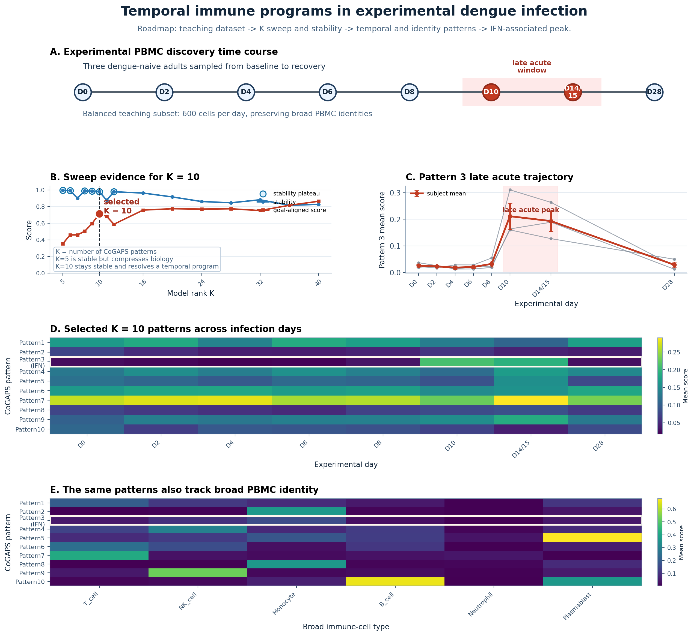

**Temporal immune programs in experimental dengue infection**

PBMC samples contain many immune-cell identities in the same expression matrix. During dengue infection, those stable identities can be layered with changing infection-response programs. In this case study, you will use CoGAPS to separate these two sources of variation: which patterns mostly describe immune-cell identity, and which patterns describe dynamic activity over time?

The source data come from Waickman et al. 2021 and GEO accession [GSE154386](https://www.ncbi.nlm.nih.gov/geo/query/acc.cgi?acc=GSE154386){target="_blank"}. The experimental discovery subset follows three subjects across eight sampling days, where `D` means day: `D0` (day 0), `D2`, `D4`, `D6`, `D8`, `D10`, `D14/15`, and `D28`. The late acute window is `D10` to `D14/15`, or approximately day 10 to day 15.

The opening figure previews the full analysis path. In CoGAPS, `K` is the number of latent patterns the model is asked to learn; here, `K = 10` means the model represents the data using 10 patterns. You should not treat this opening figure as proof yet. Instead, use it as a map for the evidence you will assemble across the case study.

You will work backward from this preview to ask how the data were prepared, why `K = 10` was selected, whether the model diagnostics support the run, which patterns change over time, which patterns mainly reflect PBMC identity, which genes support the interferon interpretation, and whether those genes increase during the late acute window.

{fig-alt="Five-panel opening roadmap figure. Panel A shows the experimental PBMC discovery time course from D0 through D28 with the late acute D10 to D14 or D15 window highlighted. Panel B shows K sweep evidence, including stability and goal-aligned scores, with K equals 10 selected. Panel C shows the Pattern 3 subject-level trajectory and mean late acute peak. Panel D shows a heatmap of selected K equals 10 pattern usage across infection days. Panel E shows a heatmap of the same patterns across broad PBMC cell identities." width=950 .lightbox}

Use the figure as an orientation point:

- **Panel A** anchors the experimental discovery subset and the infection days used in the main analysis.
- **Panel B** previews the rank-selection question: why use `K = 10` instead of the more compact `K = 5` model?
- **Panels C, D, and E** preview the pattern interpretation: one candidate interferon-associated pattern changes strongly during the late acute window, while other patterns capture temporal or broad PBMC-identity structure.

The detailed reading of each panel appears later in the visualization and analysis sections, after the data-preparation and model-selection steps have been documented.

By the end, you will connect this figure to the main learning objectives: documenting the teaching subset, reading a model-selection summary, checking model diagnostics, and interpreting latent patterns biologically.

:::{.definition_box}
::::{.definition_box_header}
Key terms
::::
::::{.inner_block}
- **PBMCs:** Peripheral blood mononuclear cells, a mixed population of immune cells isolated from blood. PBMCs include lymphocytes such as T cells, B cells, and natural killer cells, as well as monocytes and related antigen-presenting cells.
- **PBMC identity:** The relatively stable immune-cell identity of a cell, such as T cell, B cell, natural killer cell, or monocyte. A T cell remains a T cell across the infection time course, even though its gene-expression activity can change.
- **IFN:** Interferon, an antiviral signaling system that helps coordinate host responses to viral infection.
::::
:::
