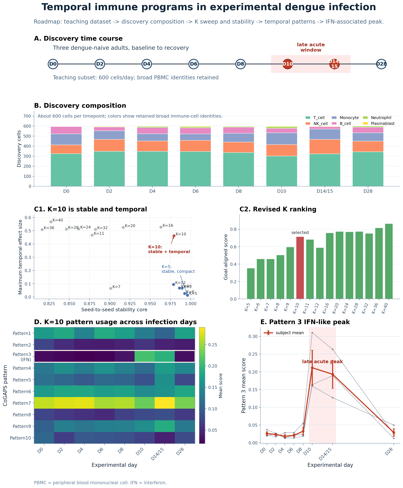

#### {.outline }

{fig-alt="Five-panel opening roadmap figure. Panel A shows the experimental PBMC discovery time course from D0 through D28 with the late acute D10 to D14 or D15 window highlighted. Panel B shows discovery set composition by timepoint as stacked bars of broad PBMC cell identities. Panel C has two K-selection views: stability versus temporal effect size and a revised goal-aligned K ranking with K equals 10 selected. Panel D shows a heatmap of selected K equals 10 pattern usage across infection days. Panel E shows the Pattern 3 subject-level trajectory and mean late acute peak." width=1100 .lightbox}

####

:::{.definition_box}
::::{.definition_box_header}
Key terms
::::
::::{.inner_block}
- **PBMCs:** Peripheral blood mononuclear cells, a mixed population of immune cells isolated from blood. PBMCs include lymphocytes such as T cells, B cells, and natural killer cells, as well as monocytes and related antigen-presenting cells.
- **PBMC identity:** The relatively stable immune-cell identity of a cell, such as T cell, B cell, natural killer cell, or monocyte. A T cell remains a T cell across the infection time course, even though its gene-expression activity can change.
- **IFN:** Interferon, an antiviral signaling system that helps coordinate host responses to viral infection.
::::
:::
