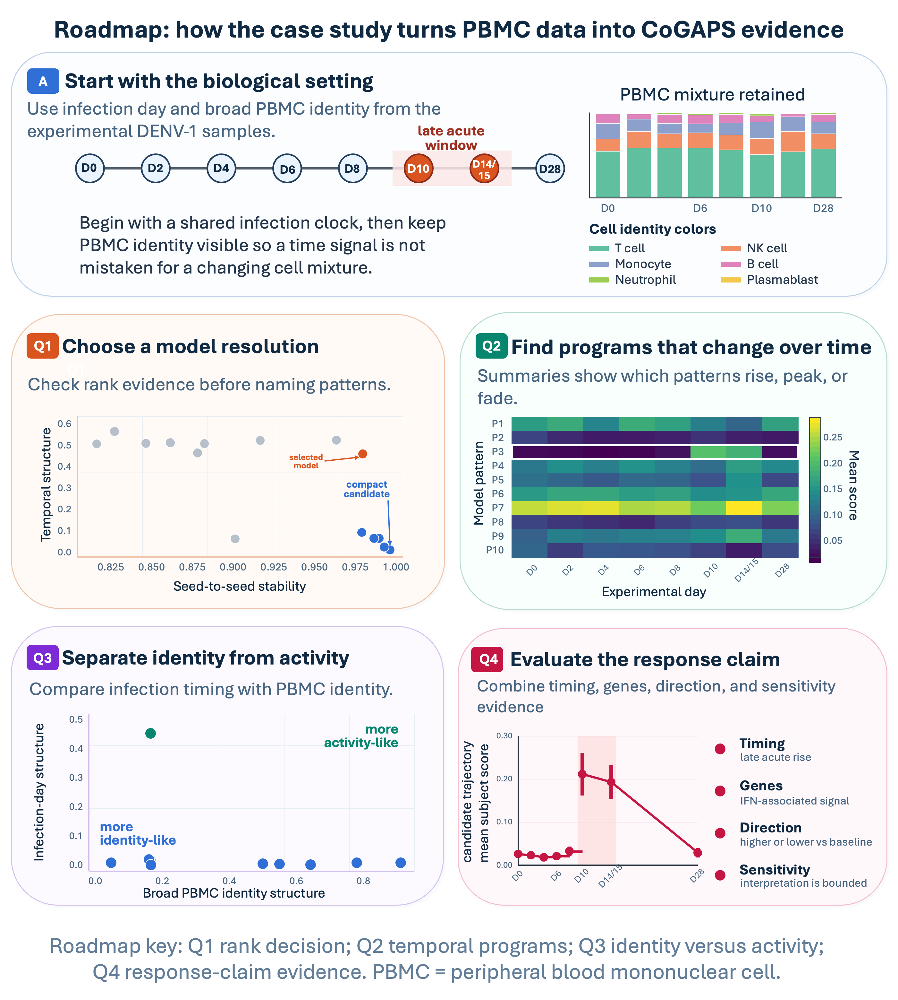

#### {.outline }

{fig-alt="Opening roadmap showing how the case study turns PBMC data into CoGAPS evidence. The top panel anchors the analysis in infection day, broad PBMC identity, and the late acute D10 to D14 or D15 window. Four question panels preview the evidence used later to choose a model resolution, find programs that change over time, separate identity from activity, and evaluate a response claim." width=1100 .lightbox}

####

:::{.definition_box}
::::{.definition_box_header}
Key terms
::::
::::{.inner_block}
- **PBMCs:** Peripheral blood mononuclear cells, a mixed population of immune cells isolated from blood. PBMCs include lymphocytes such as T cells, B cells, and natural killer cells, as well as monocytes and related antigen-presenting cells.
- **PBMC identity:** The relatively stable immune-cell identity of a cell, such as T cell, B cell, natural killer cell, or monocyte. A T cell remains a T cell across the infection time course, even though its gene-expression activity can change.
- **IFN:** Interferon, an antiviral signaling system that helps coordinate host responses to viral infection.
::::
:::
