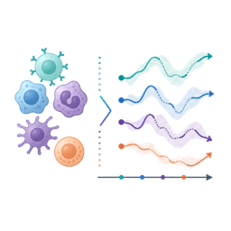

# **Main Questions**
***

The Motivation section introduced the central puzzle: temporal dengue response is mixed with PBMC identity, subject variation, and modeling choices. The questions below turn that puzzle into an evidence chain. You will first decide which  should anchor the analysis, then use the selected model to evaluate temporal programs, identity versus activity, and interferon-associated response evidence.

:::{.main_question}
::::{.main_question_header}
Our main questions
::::
::::{.inner_block}
1. Which value of  provides an appropriate CoGAPS model for this case-study goal?
2. Which temporal immune programs appear across the experimental dengue time course?
3. Which programs reflect PBMC identity, dynamic infection activity, or both?
4. What evidence supports interpreting one program as an interferon-associated late acute response?
::::
:::

<table style="min-width: 900px; border-collapse: separate; border-spacing: 0 0.85rem;">
<colgroup>
<col style="width: 150px;">
<col style="width: 28%;">
<col style="width: 32%;">
<col style="width: 28%;">
</colgroup>
<thead>
<tr style="vertical-align: top;">
<th></th>
<th>Research question</th>
<th>Where it is answered</th>
<th>Expected takeaway</th>
</tr>
</thead>
<tbody>
<tr style="vertical-align: top;">
<td></td>
<td><strong>Question 1</strong> Which value of  provides an appropriate CoGAPS model for this case-study goal?</td>
<td><strong>Data Import</strong> introduces the precomputed  before selected model outputs are loaded. <strong>Data Analysis</strong> revisits the decision with diagnostics and sensitivity evidence.</td>
<td>Explain why the selected rank is appropriate for this analysis goal, and why choosing `K` does not yet tell you what any numbered pattern means.</td>
</tr>
<tr style="vertical-align: top;">
<td></td>
<td><strong>Question 2</strong> Which  appear across the experimental dengue time course?</td>
<td><strong>Data Exploration</strong> and <strong>Data Visualization</strong> introduce , , and pattern trajectories. <strong>Data Analysis</strong> ranks the temporal evidence.</td>
<td>Identify which programs vary across infection days and describe the time windows where their scores are highest.</td>
</tr>
<tr style="vertical-align: top;">
<td></td>
<td><strong>Question 3</strong> Which programs reflect , , or both?</td>
<td><strong>Data Wrangling and Preprocessing</strong> prepares the identity/activity summary table. <strong>Data Visualization</strong> and <strong>Data Analysis</strong> compare timepoint variation, broad-cell-type variation, , and pattern-use heatmaps.</td>
<td>Distinguish patterns that look mostly identity-like, mostly activity-like, or mixed, and explain why that distinction matters for PBMC data.</td>
</tr>
<tr>
<td></td>
<td><strong>Question 4</strong> What evidence supports interpreting one program as an ?</td>
<td><strong>Data Visualization</strong> treats figures as visual triage. <strong>Data Analysis</strong> combines , , late acute trajectories, and  relative to baseline.</td>
<td>State what supports the interferon-associated interpretation and what remains bounded by the data, model, and teaching subset.</td>
</tr>
</tbody>
</table>

The first question comes before biological interpretation because every later pattern summary comes from the selected model. Choosing `K` does not tell you what a pattern means; it only defines which model you are ready to inspect. The remaining questions build the biological interpretation step by step.

***
