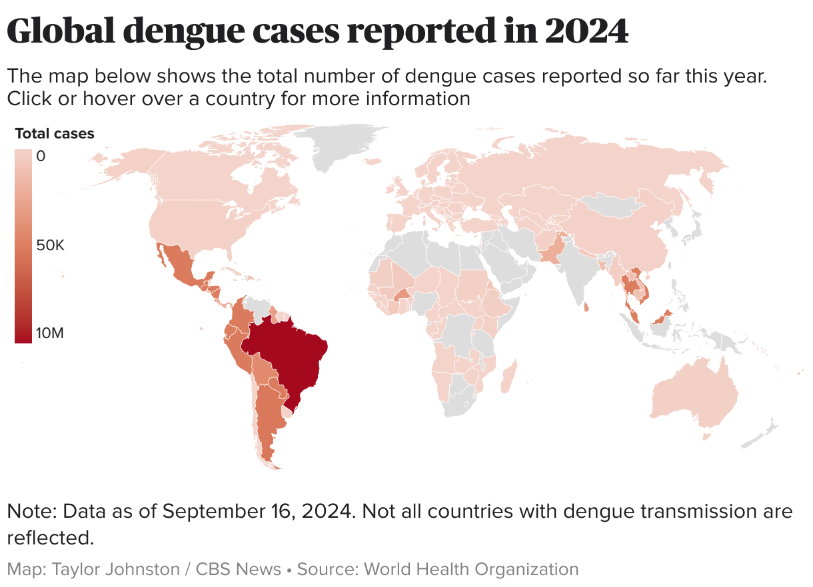

# **Motivation**
***

Dengue is a mosquito-borne viral disease with a growing global footprint. In its [2024 global dengue update](https://www.who.int/publications/i/item/who-wer10052-665-678){target="_blank"}, the World Health Organization reported 14,434,584 dengue cases across all six WHO regions, the highest global burden recorded in WHO surveillance. Dengue risk is shaped by many overlapping factors, including mosquito-vector ecology, urbanization, travel, surveillance capacity, health-system capacity, and climate-sensitive mosquito habitats.

{fig-alt="World map titled Global dengue cases reported in 2024. Countries are shaded by total reported dengue cases, with the largest reported burdens visible in parts of Latin America and Southeast Asia." width="850"}

*Image source: [CBS News, "Maps show dengue fever risk areas as CDC warns of global case surge"](https://www.cbsnews.com/news/dengue-fever-map-what-to-know-global-case-surge/){target="_blank"}.*

For this case study, the public-health problem leads to a biological question: how does the immune system change over time during dengue infection?

Blood contains many peripheral blood mononuclear cell, or PBMC, populations at once, including T cells, B cells, natural killer cells, monocytes, and antigen-presenting cells. During infection, each cell still carries its immune-cell identity, but it may also activate antiviral, inflammatory, or recovery-associated transcriptional programs.

That creates the central puzzle. If cells from day 10 look different from cells at baseline, what changed? Did the sample contain different immune-cell populations? Did one subject contribute more strongly than another? Or did similar cell types activate a shared infection-response program over time?

Ordinary clustering is useful for finding groups of similar cells, but it is not always enough for this question. A cell does not have to be only "identity" or only "response." A monocyte can remain a monocyte while also expressing an interferon-stimulated antiviral program. This case study therefore focuses on latent transcriptional programs: patterns of gene expression that can be shared across cells and vary over time.

The data come from Waickman et al. 2021, who profiled PBMCs from experimental and natural primary dengue virus type 1 infection. The natural infection samples are biologically important and appear later as optional extension material. The main analysis focuses on the experimental infection cohort because dengue-naive adults were sampled along an aligned time course, from baseline through early post-infection, late acute response, and recovery. In the source study, the experimental time course captures an early post-infection period, a day 10 late acute immune-response window, and later day 14/15 changes that may include adaptive or cytotoxic immune activity.

You will use CoGAPS to represent each cell as a non-negative mixture of latent transcriptional programs. The goal is not simply to find a pattern labeled "interferon." The goal is to learn how to evaluate whether a program is temporal, whether it reflects stable immune-cell identity or dynamic infection activity, and whether the biological interpretation is supported by diagnostics, top genes, and directionality.

Model-rank selection is part of that scientific reasoning. Choosing `K`, the number of CoGAPS patterns, changes whether broad identity structure and dynamic infection programs are separated or compressed together. In this case study, you will inspect evidence for the selected `K = 10` model while using `K = 5` as a sensitivity comparison.

These ideas lead directly into the main research questions: which temporal immune programs appear in the experimental dengue time course, which patterns look more like stable PBMC identity versus dynamic infection activity, and which evidence supports an interferon-associated late acute response.

***
