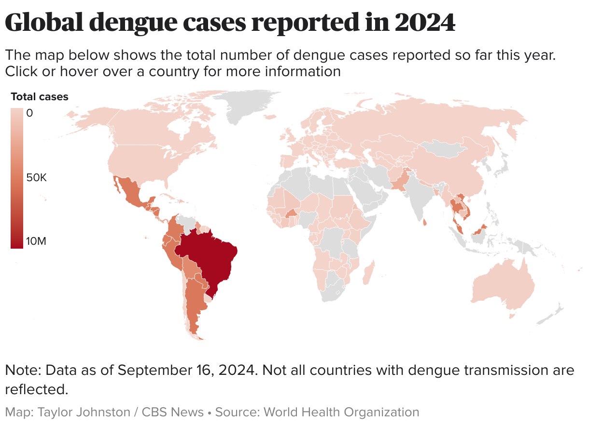

# **Motivation**
***

Dengue is a mosquito-borne viral disease with a growing global footprint [@who2025dengueFactSheet]. In its 2024 global dengue update, the World Health Organization reported 14,434,584 dengue cases across all six WHO regions, the highest global burden recorded in WHO surveillance [@who2025dengueGlobalSituation]. Dengue risk is shaped by overlapping factors, including mosquito-vector ecology, urbanization, travel, surveillance capacity, health-system capacity, and climate-sensitive mosquito habitats.

{fig-alt="World map titled Global dengue cases reported in 2024. Countries are shaded by total reported dengue cases, with the largest reported burdens visible in parts of Latin America and Southeast Asia." width="850"}

*Image source: [CBS News, "Maps show dengue fever risk areas as CDC warns of global case surge"](https://www.cbsnews.com/news/dengue-fever-map-what-to-know-global-case-surge/){target="_blank"}.*

Case counts explain why dengue matters, but this case study focuses on a more specific timing problem. Dengue infection, immune activation, warning signs, and recovery do not all happen at once. Because there is no dengue-specific antiviral treatment, clinical care depends on supportive management and close monitoring as infection unfolds [@cdc2026dengueClinicalCare]. For researchers, that same timing raises a biological question: how does the  change across infection days?

Single-cell data can help answer that question, but only if you keep the biological puzzle in view. This case study uses public data from the source study by Waickman and colleagues, who measured blood-derived immune cells during   with  [@waickman2021denv1Pbmc]. Because the  was sampled across planned infection days, the data can support a  of immune activity. The profiled cells were , or PBMCs: blood-derived immune cells including T cells, B cells, natural killer cells, monocytes, and related antigen-presenting cells. They are useful here because blood is one place where a systemic host response can be observed over time.

The main discovery data come from an . Participants were sampled on a planned schedule, so later post-infection samples can be compared with a shared  and with one another along an aligned timeline. That design lets you ask a focused temporal question: which immune programs rise, peak, persist, or fade during infection and recovery?

The challenge is that PBMC single-cell data do not contain one signal at a time. Each cell has a relatively stable : a T cell is still a T cell, and a monocyte is still a monocyte. At the same time, infection can turn on  such as antiviral signaling, inflammation, cytotoxic activity, or antibody-related responses. A later blood sample may therefore differ from baseline because the mixture of cell types changed, because the same cell types changed their activity, because subjects differ from one another, or because several of these processes happen together.

This is why the case study focuses on  rather than only on . In single-cell analysis, a cluster is a group of cells with similar overall gene-expression profiles. Clustering is useful for finding broad cell neighborhoods, but it usually treats each cell as belonging to one main group. Dengue host response is more layered than that: a monocyte can remain a monocyte while also expressing an interferon-stimulated antiviral program.

You will use , a Bayesian  method, to represent cells as additive mixtures of latent programs [@fertig2010cogaps; @johnson2023cogapsProtocol]. In plain language, CoGAPS helps ask which gene-expression patterns define the data and how strongly each cell uses each pattern. The model can therefore support a more careful question than "which cells are present?": which patterns look like stable PBMC identity, which look like dynamic infection activity, and which look mixed?

A key modeling choice is how many patterns to ask CoGAPS to learn. That number is called the , or `K`. If `K` is too small, distinct biological signals may be compressed into the same pattern. If `K` is too large, the model may split signal into patterns that are harder to interpret. Choosing `K` is therefore not just a technical setting; it shapes what biological questions the selected model can answer.

By the end of this case study, you should be able to explain why one CoGAPS pattern is interpreted as a late acute, interferon-associated activity program rather than simply a cell-identity pattern. You should also be able to name the evidence that supports that interpretation and the limits that keep the claim cautious.

The biological puzzle is now clear: temporal infection response is mixed with cell identity, subject variation, and modeling choices. The main questions below translate that puzzle into an evidence chain you will test.

***
