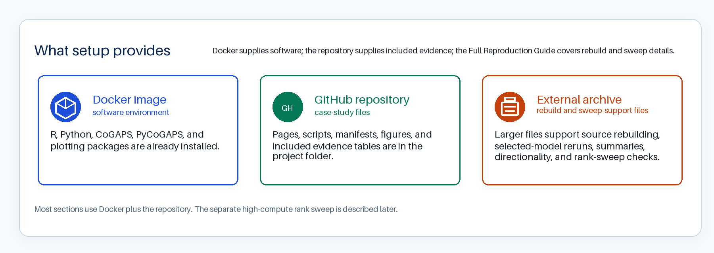

# **Packages and Setup**

This section gets your computer ready for the main lesson. You will use a Docker container so R, Python, and the required packages are already installed. The repository already includes the small evidence files used in **Data Import**, so you can begin the analysis without downloading raw GEO files or rerunning CoGAPS.

If your goal is to rebuild large files, rerun selected models, or check how the included files were produced, see [Advanced Reproduction Setup](#advanced-reproduction-setup) in the Full Reproduction Guide. You do not need those larger files to complete the main lesson.

## What the Setup Provides

Think of setup as three pieces:

| Setup piece | What it provides | When you need it |
|---|---|---|
| Docker image | R, Python, CoGAPS, PyCoGAPS, and the other software used by the case study. | Use this for the main lesson. |
| GitHub repository | The case-study pages, scripts, included analysis files, figures, and manifests. | Use this for the main lesson. |
| External reproduction archive | Large source, preprocessed, selected-model, directionality, and rank-sweep support files that are too large for GitHub. | Use this if you want to rebuild larger files or inspect the files behind the rank comparison. |

Setup has two roles in this case study. First, it gives you the software and files needed for the main lesson. Second, it keeps the larger evidence trail visible, so you can see where the included tables and figures came from without rebuilding every step yourself.

The first figure keeps the setup resources separate. Docker supplies the software environment, the GitHub repository supplies the main lesson files, and the external archive holds larger rebuild files plus files that support the separate rank-sweep checks.

{#fig-packages-setup-resources width="100%"}

Once those resources are in place, the next map separates three paths through the evidence. The brighter steps are the main lesson pieces you work with most directly in the case study. The quieter source-rebuild steps show where the included files came from. The directionality step is also muted because you inspect its included results in the main lesson, but generate that analysis only during full reproduction. The rank sweep is shown separately because it requires high-performance computing.

![Evidence-building path for the CoGAPS case study. The left panel follows the analysis from source-file import through figures and tables. Bright steps mark the evidence learners work with most directly in the main lesson. Muted steps mark source-rebuild work, the included directionality evidence inspected in the main lesson but generated during full reproduction, and the separate high-compute rank sweep. The right panel separates the main lesson path, the full reproduction path that skips the high-compute rank sweep and reruns the selected model, and the separate rank-sweep path for high-performance computing.](img/packages_setup_workflow_map_core_path_colors.png){#fig-packages-setup-evidence-path width="100%"}

The Docker image supplies software, not project data. Docker sees your local project files only when you mount the repository into the container. In the command below, your local repository is mounted at `/home/rstudio/project`.

## Main Lesson Setup

Start by cloning the case-study repository and moving into the repository root on your computer:

```bash
git clone https://github.com/opencasestudies/ocs-bio-temporal.git
cd ocs-bio-temporal
```

Then pull and launch the Docker image:

```bash
docker pull othomas2/cs5-cogaps-runtime:0.1.0

docker run --platform linux/amd64 --rm -it \
  -p 8787:8787 \
  -e PASSWORD="Password12" \
  -v "$PWD":/home/rstudio/project:rw \
  othomas2/cs5-cogaps-runtime:0.1.0
```

This command starts RStudio Server inside the container. It also mounts the cloned repository at `/home/rstudio/project`. The mount is writable (`rw`), so small outputs you create in the project folder are saved back to your local clone.

## Open RStudio Server

After Docker starts, open [http://localhost:8787](http://localhost:8787){target="_blank"} and sign in with username `rstudio` and password `Password12`. Keep the online case-study page open in one browser tab and RStudio Server open in another.

In RStudio Server, work from `/home/rstudio/project`. If you are unsure where you are, run `getwd()` in the R Console or `pwd` in the Terminal.

The schematic below labels the main panes you will use while working through the case study.

{#fig-rstudio-server-labeled}

| What you are running | Where to paste or run it | Where output appears |
|---|---|---|
| Short R chunks from an R tab | R Console, or an R script in the Source pane | Console output, Plots pane, and saved files in the Files pane |
| Short Python chunks from a Python tab | Terminal pane using `/opt/cogaps-venv/bin/python`, or a small `.py` script | Terminal output and saved files in the Files pane |

For R chunks, a common workflow is to open `File > New File > R Script`, paste the code, highlight the lines you want to run, and click **Run**. You can also paste short chunks directly into the R Console. For Python chunks, use the Terminal pane so you are running Python inside the Docker environment:

```bash
cd /home/rstudio/project
/opt/cogaps-venv/bin/python
```

You can paste short Python examples after the `>>>` prompt. For longer Python examples, save the code in a small `.py` file and run it from the Terminal.

The R and Python tabs show alternate ways to complete the same conceptual checks. Choose one language for the main lesson unless you specifically want to compare implementations. The explanations before and after the code apply to both tabs.

## Load Packages

The Docker image already installs the packages used below. Load the packages for the language you plan to use.

::: {.panel-tabset}

### R

```{r}
#| label: setup-r-packages
#| message: false
library(here)
library(readr)
library(dplyr)
library(tidyr)
library(ggplot2)
library(knitr)
library(jsonlite)

if (requireNamespace("reticulate", quietly = TRUE) &&
    file.exists("/opt/cogaps-venv/bin/python")) {
  reticulate::use_python("/opt/cogaps-venv/bin/python", required = FALSE)
}
```

### Python

```{python}
#| label: setup-python-packages
from pathlib import Path
import json

import pandas as pd
import matplotlib.pyplot as plt
```

:::

These are the main packages you will use while importing, checking, summarizing, and plotting the included files:

::: {.table-responsive}
Package | Language | What you will use it for
--- | --- | ---
[`here`](https://here.r-lib.org/){target="_blank"} | R | Build project-relative paths.
[`readr`](https://readr.tidyverse.org/){target="_blank"} | R | Read CSV tables used by the R code.
[`dplyr`](https://dplyr.tidyverse.org/){target="_blank"} | R | Select, filter, summarize, and arrange analysis tables.
[`tidyr`](https://tidyr.tidyverse.org/){target="_blank"} | R | Reshape pattern summaries into long and wide forms.
[`ggplot2`](https://ggplot2.tidyverse.org/){target="_blank"} | R | Build visualizations from tidy tables.
[`knitr`](https://yihui.org/knitr/){target="_blank"} | R | Render tables in the case-study document.
[`jsonlite`](https://jeroen.r-universe.dev/jsonlite){target="_blank"} | R | Read run manifests and diagnostic JSON files.
[`pandas`](https://pandas.pydata.org/){target="_blank"} | Python | Read, filter, and summarize CSV tables.
[`matplotlib`](https://matplotlib.org/){target="_blank"} | Python | Build Python visualizations.
:::

A fuller software list for rebuilding larger workflow outputs is included in [Advanced Software Reference](#advanced-software-reference).

## Readiness Check

These checks confirm that the main-lesson packages are available in the language you choose.

::: {.panel-tabset}

### R

```{r}
#| label: runtime-check-r
#| message: false
#| warning: false
r_required <- c("here", "readr", "dplyr", "tidyr", "ggplot2", "knitr", "jsonlite")

r_versions <- vapply(
  r_required,
  function(pkg) as.character(utils::packageVersion(pkg)),
  character(1)
)

data.frame(
  item = c("R", r_required, "reticulate_available"),
  value = c(
    R.version.string,
    unname(r_versions),
    as.character(requireNamespace("reticulate", quietly = TRUE))
  )
) |>
  knitr::kable()
```

### Python

```{python}
#| label: runtime-check-python
import sys

import matplotlib
import pandas as pd

pd.DataFrame(
    {
        "item": [
            "Python",
            "pandas",
            "matplotlib",
        ],
        "value": [
            sys.version.split()[0],
            pd.__version__,
            matplotlib.__version__,
        ],
    }
)
```

:::

Now check that the mounted project folder contains the included files used at the start of the case study.

::: {.panel-tabset}

### R

```{r}
#| label: runtime-check-files-r
#| message: false
#| warning: false
data.frame(
  item = c(
    "case-study manifest",
    "included processed folder",
    "rank-selection evidence"
  ),
  available = c(
    file.exists(here::here("data", "artifact_manifest.json")),
    dir.exists(here::here("data", "processed")),
    dir.exists(here::here("data", "processed", "k_selection"))
  )
) |>
  knitr::kable()
```

### Python

```{python}
#| label: runtime-check-files-python
from pathlib import Path

import pandas as pd

pd.DataFrame({
    "item": [
        "case-study manifest",
        "included processed folder",
        "rank-selection evidence",
    ],
    "available": [
        Path("data/artifact_manifest.json").exists(),
        Path("data/processed").is_dir(),
        Path("data/processed/k_selection").is_dir(),
    ],
})
```

:::

Data Import will check the specific selected-model folder after you evaluate the rank-selection evidence.

When a function is introduced for the first time, the prose uses the `package::function()` form so you can see which package provides it. Next, you will import the rank-selection evidence, use it to choose which CoGAPS model is worth inspecting, and then load the selected-model files used through the rest of the case study.
