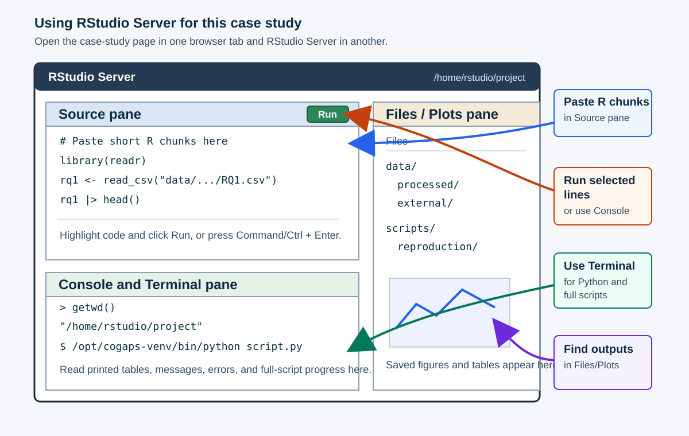

# **Packages and Setup**

This case study has two ready-to-run paths. Both use the same Docker image, which provides the software environment, and both start from a local copy of the case-study repository.

The **standard path** is the recommended path for most learners. It uses small CSV, JSON, and figure files already included in the repository, so you can focus on importing, summarizing, visualizing, diagnosing, and interpreting the selected `K = 10` model outputs.

The **full reproduction path** is optional. Use it if you want to regenerate the prepared discovery-set files, rerun the selected `K = 10` CoGAPS model, or recreate directionality outputs. This path requires the large reproduction files from Zenodo and more time and storage. It does not include rerunning the full K-selection sweep; the sweep is treated as precomputed evidence that you will inspect in the analysis section.

| Path | Use it when you want to... | Files you need | How you run code |
|---|---|---|---|
| Standard path | Complete the main analysis efficiently and learn how the selected model is interpreted. | The cloned case-study repository. | Copy short R or Python chunks from the case study into RStudio Server. |
| Full reproduction path | Regenerate major selected-model inputs or outputs after downloading the large files. | The cloned repository plus the Zenodo reproduction files. | Run complete scripts inside the same Docker image. |
| K-selection evidence | Understand why `K = 10` was selected. | Included K-selection tables and figures; documented sweep scripts. | Inspect precomputed summaries and selected code excerpts, but do not rerun the sweep. |

The Docker image supplies software, not project data. The `-v` options in the commands below mount local folders into the container so RStudio Server can see them.

## Use RStudio Server

Both ready-to-run paths use RStudio Server inside the Docker image. After Docker starts, open [http://localhost:8787](http://localhost:8787){target="_blank"} and sign in with username `rstudio` and password `Password12`. Keep the online case-study page open in one browser tab and RStudio Server open in another.

In RStudio Server, work from `/home/rstudio/project`. That folder is the copy of the case-study repository that you mounted with Docker. If you are unsure where you are, run `getwd()` in the R Console or `pwd` in the Terminal.

The schematic below labels the main panes you will use while working through the case study.

{#fig-rstudio-server-labeled}

| What you are running | Where to paste or run it | Where output appears |
|---|---|---|
| Short R chunks from an R tab | R Console, or an R script in the Source pane | Console output, Plots pane, and saved files in the Files pane |
| Short Python chunks from a Python tab | Terminal pane using `/opt/cogaps-venv/bin/python`, or a small `.py` script | Terminal output and saved files in the Files pane |
| Full reproduction scripts | Terminal pane from `/home/rstudio/project` | Terminal progress messages, logs, and regenerated output folders |

For R chunks, a common workflow is to open `File > New File > R Script`, paste the code, highlight the lines you want to run, and click **Run**. You can also paste short chunks directly into the R Console. For Python chunks, use the Terminal pane so you are running Python inside the Docker environment:

```bash
cd /home/rstudio/project
/opt/cogaps-venv/bin/python
```

You can paste short Python examples after the `>>>` prompt. For longer Python examples, save the code in a small `.py` file and run it from the Terminal.

## Standard Path Setup

Start here unless you specifically want to regenerate large files. First clone the case-study repository and move into the repository root:

```bash
git clone https://github.com/opencasestudies/ocs-bio-temporal.git
cd ocs-bio-temporal
```

Then pull and launch the runtime image:

```bash
docker pull othomas2/cs5-cogaps-runtime:0.1.0

docker run --platform linux/amd64 --rm -it \
  -p 8787:8787 \
  -e PASSWORD="Password12" \
  -v "$PWD":/home/rstudio/project:rw \
  othomas2/cs5-cogaps-runtime:0.1.0
```

This command mounts the cloned GitHub repository into the container at `/home/rstudio/project`. The mount is writable (`rw`) so any small outputs you create in the project folder are saved back to your local clone.

Open [http://localhost:8787](http://localhost:8787){target="_blank"} and sign in with username `rstudio` and password `Password12`. In RStudio Server, open the folder `/home/rstudio/project` or set that as your working directory before running code from the case study.

For the standard path, you will mostly copy short chunks from the R or Python tabs in the case study. Run one chunk at a time and inspect the output before moving on. Tables usually print in the Console or Terminal, plots appear in the Plots pane, and files created by the code appear in the Files pane under the project folder.

The R and Python tabs are alternate implementations. Choose one language unless you specifically want to compare how the same task looks in both languages.

## Full Reproduction Setup

Use this path only if you have downloaded the large reproduction files from the case-study Zenodo record. During draft review, the Zenodo record is listed as DOI pending publication in the front matter. Once the record is public, download the reproduction files into a local folder outside the Git repository.

For example:

```bash
mkdir -p "$HOME/cs5_zenodo"

# Download the large reproduction files from Zenodo into this folder.
# If Zenodo provides a zip or tar archive, extract it here before launching Docker.
export CS5_ZENODO_DIR="$HOME/cs5_zenodo"
```

Then launch the same Docker image while mounting both the GitHub repository and the Zenodo download folder:

```bash
docker run --platform linux/amd64 --rm -it \
  -p 8787:8787 \
  -e PASSWORD="Password12" \
  -v "$PWD":/home/rstudio/project:rw \
  -v "$CS5_ZENODO_DIR":/home/rstudio/project/data/external/zenodo:ro \
  othomas2/cs5-cogaps-runtime:0.1.0
```

This command mounts the repository at `/home/rstudio/project` and the Zenodo files at `/home/rstudio/project/data/external/zenodo`. The Zenodo mount is read-only (`ro`) so the original downloaded files are not modified. Later full-reproduction scripts should write regenerated outputs to a writable project folder, such as `/home/rstudio/project/data/external/GSE154386`, or to another output folder that you intentionally mount.

For the full reproduction path, use complete scripts rather than pasting every code chunk by hand. The workflow begins with the preparation script that downloads or reuses the GEO source archive, imports the 10x files, applies preprocessing decisions, and constructs the balanced discovery set. After that, the selected-model and interpretation scripts use those prepared inputs.

In RStudio Server, open the Terminal pane and inspect the script folders:

```bash
cd /home/rstudio/project
ls scripts
ls scripts/reproduction
cat scripts/reproduction/README.md
```

The main full-reproduction scripts are:

| Order | Goal | Script |
|---|---|---|
| 1 | Download/import/preprocess the source data and construct the discovery set in R | `scripts/prepare_gse154386_subset_r.R` |
| 1 | Download/import/preprocess the source data and construct the discovery set in Python | `scripts/prepare_gse154386_subset_python.py` |
| 2 | Run the selected `K = 10` model in R | `scripts/reproduction/cs5_run_selected_model_r.R` |
| 2 | Run the selected `K = 10` model in Python | `scripts/reproduction/cs5_run_selected_model_python.py` |
| 3 | Build interpretation-layer tables | `scripts/reproduction/cs5_build_k10_interpretation_layer.py` |
| 4 | Run directionality analysis | `scripts/reproduction/gse154386_pattern_directionality.py` |

Choose the R or Python preparation script for step 1; you do not need to run both unless you want to compare the two implementations. The later scripts expect the prepared discovery-set files to exist before CoGAPS or interpretation steps are rerun.

Run R scripts with `Rscript` and Python scripts with the Docker image's Python environment:

```bash
Rscript scripts/prepare_gse154386_subset_r.R
# or:
/opt/cogaps-venv/bin/python scripts/prepare_gse154386_subset_python.py

Rscript scripts/reproduction/cs5_run_selected_model_r.R
/opt/cogaps-venv/bin/python scripts/reproduction/cs5_run_selected_model_python.py
/opt/cogaps-venv/bin/python scripts/reproduction/cs5_build_k10_interpretation_layer.py
/opt/cogaps-venv/bin/python scripts/reproduction/gse154386_pattern_directionality.py
```

The K-selection sweep scripts are also included in `scripts/reproduction` for provenance and teaching. They are not part of the standard path or the full reproduction path described here.

## Load Packages

The code chunks below load the packages used for the standard path. You may work in R or Python; the two tabs show alternate implementations of the same ideas.

::: {.panel-tabset}

### R

```{r}
#| label: setup-r-packages
#| message: false
library(here)
library(readr)
library(dplyr)
library(tidyr)
library(ggplot2)
library(knitr)
library(jsonlite)

if (requireNamespace("reticulate", quietly = TRUE) &&
    file.exists("/opt/cogaps-venv/bin/python")) {
  reticulate::use_python("/opt/cogaps-venv/bin/python", required = FALSE)
}
```

### Python

```{python}
#| label: setup-python-packages
from pathlib import Path
import json

import pandas as pd
import matplotlib.pyplot as plt
```

:::

The R and Python tabs are alternate ways to complete the same analysis. You do not need to run both languages unless you want to inspect both examples.

Package | Language | Role | Use
--- | --- | --- | ---
[`here`](https://here.r-lib.org/){target="_blank"} | R | Standard path | Build project-relative paths.
[`readr`](https://readr.tidyverse.org/){target="_blank"} | R | Standard path | Read CSV tables used by the R code.
[`dplyr`](https://dplyr.tidyverse.org/){target="_blank"} | R | Standard path | Select, filter, summarize, and arrange analysis tables.
[`tidyr`](https://tidyr.tidyverse.org/){target="_blank"} | R | Standard path | Reshape pattern summaries into long and wide forms.
[`ggplot2`](https://ggplot2.tidyverse.org/){target="_blank"} | R | Standard path | Build visualizations from tidy tables.
[`knitr`](https://yihui.org/knitr/){target="_blank"} | R | Standard path | Render tables in the case-study document.
[`jsonlite`](https://jeroen.r-universe.dev/jsonlite){target="_blank"} | R | Standard path | Read run manifests and diagnostic JSON files.
[`reticulate`](https://rstudio.github.io/reticulate/){target="_blank"} | R | Optional bridge | Connect R to the Python environment inside the Docker image.
[`pandas`](https://pandas.pydata.org/){target="_blank"} | Python | Standard path | Read, filter, and summarize CSV tables.
[`matplotlib`](https://matplotlib.org/){target="_blank"} | Python | Standard path | Build Python visualizations.
[`CoGAPS`](https://bioconductor.org/packages/CoGAPS){target="_blank"} | R | Optional full reproduction | Run the R implementation of CoGAPS.
[`PyCoGAPS`](https://github.com/FertigLab/pycogaps){target="_blank"} | Python | Optional full reproduction | Run the Python implementation of CoGAPS.
[`scanpy`](https://scanpy.readthedocs.io/){target="_blank"} | Python | Optional full reproduction | Preprocess and inspect single-cell objects.
[`anndata`](https://anndata.readthedocs.io/){target="_blank"} | Python | Optional full reproduction | Read and write H5AD single-cell objects.

## Check the Runtime

These checks confirm that the standard-path packages are available in the language you choose. They also report whether optional full-reproduction packages are installed in the Docker image.

::: {.panel-tabset}

### R

```{r}
#| label: runtime-check-r
#| message: false
#| warning: false
r_required <- c("here", "readr", "dplyr", "tidyr", "ggplot2", "knitr", "jsonlite")

r_versions <- vapply(
  r_required,
  function(pkg) as.character(utils::packageVersion(pkg)),
  character(1)
)

data.frame(
  item = c("R", r_required, "reticulate_available", "CoGAPS_available"),
  value = c(
    R.version.string,
    unname(r_versions),
    as.character(requireNamespace("reticulate", quietly = TRUE)),
    as.character(requireNamespace("CoGAPS", quietly = TRUE))
  )
) |>
  knitr::kable()
```

### Python

```{python}
#| label: runtime-check-python
import importlib.util
import sys

import matplotlib

pd.DataFrame(
    {
        "item": [
            "Python",
            "pandas",
            "matplotlib",
            "PyCoGAPS_available",
            "scanpy_available",
            "anndata_available",
        ],
        "value": [
            sys.version.split()[0],
            pd.__version__,
            matplotlib.__version__,
            str(importlib.util.find_spec("PyCoGAPS") is not None),
            str(importlib.util.find_spec("scanpy") is not None),
            str(importlib.util.find_spec("anndata") is not None),
        ],
    }
)
```

:::

When a function is introduced for the first time, the prose uses the `package::function()` form so you can see which package provides it. Next, you will import the small selected-model files that carry the `K = 10` CoGAPS results through the rest of the case study.
