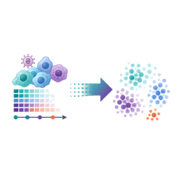

# **Suggested Homework or Further Exploration**
***

These are individual exercises. Each can be completed by one learner without a group project.

## **Core Homework**

1. Recreate the K-selection table and write a short justification for selecting `K = 10` over `K = 5`.
1. Choose one identity-like pattern and annotate it using its top genes, dominant broad cell type, and time-course behavior.
1. Replot the IFN-associated pattern trajectory with one panel per subject.
1. Use the directionality table to identify which top IFN-associated genes are most consistently up at `D10` and `D14/15`.
1. Inspect the selected-model metrics and write a short note about whether the diagnostic traces support using the precomputed result for interpretation.

## **Side Quests**

1. Redraw the pattern-by-cell-type heatmap using a different color scale and explain whether the interpretation changes.
1. Repeat the identity-versus-activity classification with a different ratio cutoff, such as 1.25 or 2.0, and record which pattern labels change.
1. Compare `K = 5` and `K = 10` top genes for the strongest time-varying pattern in each model.
1. Create a small glossary entry for one method concept, such as non-negative matrix factorization, pseudobulk, OpenMP, or transfer learning.

## **Optional Natural Infection Projection**

<table>
  <colgroup>
    <col style="width: 150px;">
    <col>
  </colgroup>
  <thead>
    <tr>
      <th></th>
      <th>Optional extension</th>
    </tr>
  </thead>
  <tbody>
    <tr>
      <td></td>
      <td><strong>Can programs learned from the experimental infection cohort be projected into natural primary dengue infection samples?</strong> This extension is framed as a planning and reproduction exercise. The current rendered case study does not claim final natural-cohort projection results because those samples are not aligned to the same experimental clock.</td>
    </tr>
  </tbody>
</table>

1. Draft the projection analysis plan, including the input object, learned gene-loading matrix, projection method, and expected output tables.
1. Define what would count as evidence that an experimental IFN-associated program transfers into natural infection.
1. List at least two limitations that would make the natural-projection interpretation weaker than the experimental time-course interpretation.

## **Challenge Extension**

Rerun the selected `K = 10` model locally in the Docker image using the external large H5AD artifacts. Then compare your newly generated metrics JSON with the precomputed metrics in this repository.

***
